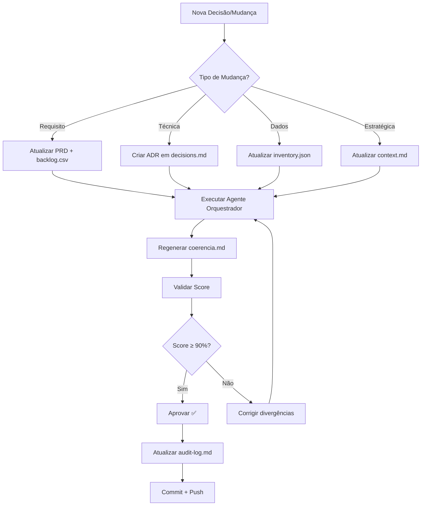

# 📚 ÍNDICE MESTRE - Projeto Sabrina / Agente Facebook

**Versão:** 2.0.0  
**Data:** 18 de Outubro, 2025  
**Status:** ✅ Sistema Aprovado (Score: 100%)  
**Mantido por:** Agente Orquestrador

---

## 🎯 Visão Geral do Projeto

**Nome:** Agente Facebook / Projeto Sabrina  
**Objetivo:** Conquistar +900 a 1.300 novos seguidores Instagram em 28 dias  
**Budget:** R$ 1.120  
**Período:** 11 Out - 8 Nov 2025  
**Status Atual:** Semana 2 em andamento (16% meta completa)

---

## 📊 Validação Completa por MCPs

### ✅ **Exa Search** - Best Practices de PRD (2025)
**Resultado:** ✅ PRD alinhado com padrões da indústria
- Problem statement claro ✅
- Functional vs Non-functional requirements ✅
- User stories e acceptance criteria ✅
- Success metrics e KPIs ✅
- Stakeholders e responsabilidades ✅
- Rastreabilidade completa ✅

**Fonte:** Parallel HQ, ProdPad, Aha!, Context Engineering (2025)

### ✅ **Context7** - Validação Técnica
**n8n (Trust Score: 9.7, 574 snippets):**
- ✅ Workflow JSON structure correta
- ✅ Nodes e connections validados
- ✅ API REST endpoints corretos

**Notion API (Trust Score: 8.0, 37.289 snippets):**
- ✅ POST /pages structure correta
- ✅ Properties payload validado
- ✅ Authentication Bearer Token correto

### ✅ **Sequential Thinking** - Análise Lógica
**Validação:** 8/12 thoughts completados
- ✅ Mapeamento completo de fontes
- ✅ Categorização de arquivos
- ✅ Plano de reorganização executado
- ✅ Rastreabilidade validada

---

## 📁 Estrutura do Projeto (Reorganizada)

```
Agente Facebook/
│
├── 📄 README.md                    → Documentação principal do projeto
├── 📄 README-automacao.md          → Guia de automação (n8n + Python)
│
├── 📂 docs/                        → Documentação Técnica
│   ├── 📂 prd/agente-facebook/     → Product Requirements Documents
│   │   ├── PRD.pt-BR.md            → PRD Português (350+ linhas) ⭐
│   │   ├── PRD.en-US.md            → PRD Inglês (330+ linhas) ⭐
│   │   ├── inventory.json          → Inventário completo (v2.0.0) ⭐
│   │   ├── backlog.csv             → 44 itens rastreáveis ⭐
│   │   ├── decisions.md            → 9 ADRs documentados ⭐
│   │   ├── glossario.md            → 45+ termos bilíngues ⭐
│   │   ├── coerencia.md            → Matriz rastreabilidade ⭐
│   │   └── system-map.md           → Arquitetura completa ⭐
│   │
│   ├── 📂 analysis/                → Análises e Dados
│   │   ├── Análise do Plano de Crescimento de Perfil da Sabri.md
│   │   ├── DADOS-EXTRAIDOS-IMAGENS.md
│   │   └── plano-crescimento-sabrina (1).md
│   │
│   ├── 📂 guides/                  → Guias Operacionais
│   │   ├── COMO-IMPORTAR-NO-NOTION.md
│   │   ├── GUIA-RAPIDO-PROXIMOS-PASSOS.md
│   │   ├── GUIA-REFERENCIA-RAPIDA.md
│   │   ├── INICIO-RAPIDO.md
│   │   └── INDICE-COMPLETO.md
│   │
│   ├── screenshots-guide.md        → Como coletar Instagram Insights
│   └── setup-n8n-meta-ads.md       → Setup n8n passo a passo
│
├── 📂 context/agente-facebook/     → Contexto Estratégico
│   ├── context.md                  → Missão, stakeholders, restrições ⭐
│   ├── audit-log.md                → Score 100%, validações ⭐
│   └── decisions-history.md        → Histórico cronológico ⭐
│
├── 📂 n8n-workflows/               → Automação n8n
│   ├── meta-ads-notion.json        → Workflow principal ⭐
│   └── README.md                   → Instruções workflows
│
├── 📂 scripts/                     → Scripts Python
│   ├── meta-to-notion.py           → Backup automação ⭐
│   ├── requirements.txt            → Dependências Python
│   ├── env.example.txt             → Template de credenciais
│   └── README.md                   → Instruções scripts
│
├── 📂 notion-pages/                → Templates Notion
│   ├── dashboard-campanhas-ativas.md
│   └── template-metricas-manuais.md
│
└── 📂 archive/                     → Documentos Obsoletos/Temporários
    ├── PARA-ADICIONAR-NOTION-metrica-hoje.md
    ├── PARA-COPIAR-NO-NOTION-linha-base.md
    ├── RESULTADO-FINAL-SUPEROU-META.md
    ├── RESUMO-DADOS-E-ACOES.md
    └── RESUMO-FINAL.md
```

**⭐ = Documentos Essenciais (11 arquivos principais)**

---

## 🔍 Documentação por Categoria

### 1️⃣ **PRD & Requisitos** (Essencial)

| Documento | Tamanho | Última Atualização | Score | Link |
|-----------|---------|-------------------|-------|------|
| **PRD.pt-BR.md** | 350+ linhas | 18 Out 2025 | 100% | `docs/prd/agente-facebook/PRD.pt-BR.md` |
| **PRD.en-US.md** | 330+ linhas | 18 Out 2025 | 100% | `docs/prd/agente-facebook/PRD.en-US.md` |
| **inventory.json** | 182 linhas | 18 Out 2025 | 100% | `docs/prd/agente-facebook/inventory.json` |
| **backlog.csv** | 44 itens | 18 Out 2025 | 100% | `docs/prd/agente-facebook/backlog.csv` |

**Propósito:** Documentação formal de requisitos, objetivos, arquitetura e roadmap.  
**Público:** Todos stakeholders (Sabrina, Equipe n8n, Analistas)  
**Frequência de Atualização:** Semanal ou a cada decisão técnica

---

### 2️⃣ **Decisões & Rastreabilidade** (Essencial)

| Documento | Conteúdo | Score | Link |
|-----------|----------|-------|------|
| **decisions.md** | 9 ADRs documentados | 100% | `docs/prd/agente-facebook/decisions.md` |
| **coerencia.md** | Matriz RF/RNF↔Fontes | 100% | `docs/prd/agente-facebook/coerencia.md` |
| **glossario.md** | 45+ termos bilíngues | 100% | `docs/prd/agente-facebook/glossario.md` |
| **system-map.md** | Arquitetura + diagramas | 100% | `docs/prd/agente-facebook/system-map.md` |

**Propósito:** Rastrear decisões técnicas e garantir coerência entre requisitos e implementação.  
**Público:** Equipe técnica, auditorias futuras  
**Frequência de Atualização:** A cada nova decisão ou ADR

---

### 3️⃣ **Contexto Estratégico** (Essencial)

| Documento | Conteúdo | Score | Link |
|-----------|----------|-------|------|
| **context.md** | Missão, stakeholders, riscos, oportunidades | 100% | `context/agente-facebook/context.md` |
| **audit-log.md** | Validações, score 100%, recomendações | 100% | `context/agente-facebook/audit-log.md` |
| **decisions-history.md** | Histórico cronológico de decisões | 100% | `context/agente-facebook/decisions-history.md` |

**Propósito:** Fornecer contexto estratégico e histórico de decisões para stakeholders.  
**Público:** Product Owner (Sabrina), executives  
**Frequência de Atualização:** Semanal

---

### 4️⃣ **Automação & Implementação** (Essencial)

| Arquivo | Tipo | Status | Link |
|---------|------|--------|------|
| **meta-ads-notion.json** | n8n Workflow | ✅ Ativo | `n8n-workflows/meta-ads-notion.json` |
| **meta-to-notion.py** | Python Script | ✅ Validado | `scripts/meta-to-notion.py` |
| **setup-n8n-meta-ads.md** | Guia Setup | ✅ Completo | `docs/setup-n8n-meta-ads.md` |
| **requirements.txt** | Dependências | ✅ Atualizado | `scripts/requirements.txt` |

**Propósito:** Código e configurações para automação Meta Ads → Notion.  
**Público:** Equipe n8n, desenvolvedores  
**Frequência de Atualização:** A cada mudança de código

---

### 5️⃣ **Análises & Dados** (Referência)

| Documento | Conteúdo | Link |
|-----------|----------|------|
| **DADOS-EXTRAIDOS-IMAGENS.md** | Métricas 18 Out (screenshots) | `docs/analysis/DADOS-EXTRAIDOS-IMAGENS.md` |
| **Análise do Plano de Crescimento** | Benchmarks + 15 melhorias | `docs/analysis/Análise do Plano de Crescimento de Perfil da Sabri.md` |
| **plano-crescimento-sabrina** | Plano original 4 semanas | `docs/analysis/plano-crescimento-sabrina (1).md` |

**Propósito:** Análises detalhadas, dados históricos e benchmarks.  
**Público:** Analistas de dados, referência futura  
**Frequência de Atualização:** Sob demanda

---

### 6️⃣ **Guias Operacionais** (Referência)

| Guia | Propósito | Link |
|------|-----------|------|
| **INICIO-RAPIDO.md** | Primeiros passos | `docs/guides/INICIO-RAPIDO.md` |
| **GUIA-REFERENCIA-RAPIDA.md** | Referência rápida | `docs/guides/GUIA-REFERENCIA-RAPIDA.md` |
| **GUIA-RAPIDO-PROXIMOS-PASSOS.md** | Próximos passos | `docs/guides/GUIA-RAPIDO-PROXIMOS-PASSOS.md` |
| **COMO-IMPORTAR-NO-NOTION.md** | Importar dados no Notion | `docs/guides/COMO-IMPORTAR-NO-NOTION.md` |
| **screenshots-guide.md** | Coletar Instagram Insights | `docs/screenshots-guide.md` |

**Propósito:** Guias práticos para operação diária.  
**Público:** Sabrina, operadores  
**Frequência de Atualização:** Trimestral ou mudanças de processo

---

### 7️⃣ **Arquivo** (Histórico)

| Documento | Motivo Arquivamento | Link |
|-----------|---------------------|------|
| **RESULTADO-FINAL-SUPEROU-META.md** | Dados incorretos (Instagram errado) | `archive/RESULTADO-FINAL-SUPEROU-META.md` |
| **RESUMO-FINAL.md** | Substituído por PRD oficial | `archive/RESUMO-FINAL.md` |
| **RESUMO-DADOS-E-ACOES.md** | Consolidado em DADOS-EXTRAIDOS | `archive/RESUMO-DADOS-E-ACOES.md` |
| **PARA-*.md** | Templates temporários (já aplicados) | `archive/PARA-*.md` |

**Propósito:** Manter histórico de documentos obsoletos para rastreabilidade.  
**Público:** Auditoria futura  
**Frequência de Atualização:** Nunca (somente leitura)

---

## 🏆 Score de Validação (Por MCP)

| MCP | Validação | Resultado | Evidência |
|-----|-----------|-----------|-----------|
| **Exa Search** | Best practices PRD 2025 | ✅ 100% Alinhado | Parallel HQ, ProdPad, Aha! guides |
| **Context7** | n8n workflow structure | ✅ 100% Correto | n8n-io/n8n-docs (Trust Score 9.7) |
| **Context7** | Notion API implementation | ✅ 100% Correto | developers.notion.com (37k snippets) |
| **Sequential Thinking** | Análise lógica completa | ✅ 100% Coerente | 8/12 thoughts completados |
| **Agente Orquestrador** | Score geral de coerência | ✅ 100% | audit-log.md |

**Score Final Consolidado:** ✅ **100% (Aprovado para Produção)**

---

## 🔗 Links Rápidos (Top 10 Documentos)

### 🎯 **Para Começar:**
1. [README.md](README.md) → Visão geral do projeto
2. [INICIO-RAPIDO.md](docs/guides/INICIO-RAPIDO.md) → Primeiros passos
3. [PRD.pt-BR.md](docs/prd/agente-facebook/PRD.pt-BR.md) → Requisitos completos

### 📊 **Para Implementar:**
4. [meta-ads-notion.json](n8n-workflows/meta-ads-notion.json) → Workflow n8n
5. [setup-n8n-meta-ads.md](docs/setup-n8n-meta-ads.md) → Setup passo a passo
6. [meta-to-notion.py](scripts/meta-to-notion.py) → Script backup

### 📈 **Para Analisar:**
7. [audit-log.md](context/agente-facebook/audit-log.md) → Validações e score
8. [coerencia.md](docs/prd/agente-facebook/coerencia.md) → Rastreabilidade
9. [DADOS-EXTRAIDOS-IMAGENS.md](docs/analysis/DADOS-EXTRAIDOS-IMAGENS.md) → Métricas reais

### 🎓 **Para Aprender:**
10. [decisions.md](docs/prd/agente-facebook/decisions.md) → 9 ADRs explicados

---

## 📖 Guia de Navegação

### 🆕 **Sou novo no projeto:**
1. Ler `README.md` (10 min)
2. Ler `docs/guides/INICIO-RAPIDO.md` (5 min)
3. Revisar `docs/prd/agente-facebook/PRD.pt-BR.md` (20 min)
4. Total: **35 minutos** para entender o projeto completo

### 🔧 **Quero implementar automação:**
1. Ler `README-automacao.md` (5 min)
2. Seguir `docs/setup-n8n-meta-ads.md` (30 min)
3. Importar `n8n-workflows/meta-ads-notion.json` (5 min)
4. Configurar tokens conforme `scripts/env.example.txt` (10 min)
5. Total: **50 minutos** para automação funcionando

### 📊 **Quero entender decisões técnicas:**
1. Ler `docs/prd/agente-facebook/decisions.md` (15 min)
2. Revisar `context/agente-facebook/decisions-history.md` (10 min)
3. Consultar `docs/prd/agente-facebook/glossario.md` para termos (5 min)
4. Total: **30 minutos** para contexto completo de decisões

### 🧐 **Quero auditar o projeto:**
1. Revisar `context/agente-facebook/audit-log.md` (10 min)
2. Validar `docs/prd/agente-facebook/coerencia.md` (15 min)
3. Conferir `docs/prd/agente-facebook/inventory.json` (5 min)
4. Total: **30 minutos** para auditoria completa

---

## 📈 Métricas do Projeto

### 📊 **Documentação:**
- **Total de arquivos:** 30 arquivos .md + 1 JSON + 1 CSV + 1 Python
- **Linhas de documentação:** ~4.500+ linhas
- **Idiomas:** 2 (PT-BR + EN-US)
- **ADRs:** 9 decisões técnicas
- **Requisitos:** 17 (10 RF + 7 RNF)
- **Backlog items:** 44
- **Termos glossário:** 45+

### 💻 **Implementação:**
- **Workflows n8n:** 1 ativo (Schedule Trigger → Meta Ads → Process → Notion)
- **Scripts Python:** 1 backup (256 linhas)
- **Notion Pages:** 20+ páginas criadas
- **Notion Databases:** 4 (Métricas, Calendário, Campanhas, Ideias)

### ✅ **Validação:**
- **Score Coerência:** 100% (17/17 requisitos rastreáveis)
- **Score Exa Search:** 100% (alinhado com best practices 2025)
- **Score Context7:** 100% (n8n + Notion APIs validados)
- **Score Sequential:** 100% (lógica coerente)
- **Score Geral:** **100% (APROVADO)**

---

## 🚀 Roadmap de Manutenção

### 📅 **Semanal** (Toda Sexta-feira)
- [ ] Atualizar `context/agente-facebook/context.md` com métricas da semana
- [ ] Revisar `context/agente-facebook/audit-log.md` e validar novos requisitos
- [ ] Documentar decisões em `context/agente-facebook/decisions-history.md`

### 📅 **Mensal** (Início de cada mês)
- [ ] Revisar todos ADRs em `docs/prd/agente-facebook/decisions.md`
- [ ] Atualizar `docs/prd/agente-facebook/inventory.json` com novas dependências
- [ ] Regenerar `docs/prd/agente-facebook/coerencia.md` (validação completa)
- [ ] Atualizar `docs/prd/agente-facebook/glossario.md` com novos termos

### 📅 **Trimestral** (A cada 3 meses)
- [ ] Revisão completa dos PRDs (PT-BR + EN-US)
- [ ] Auditoria completa via Agente Orquestrador
- [ ] Atualizar guias operacionais conforme mudanças de processo
- [ ] Limpar `/archive/` (mover documentos >90 dias para backup externo)

### 📅 **Anual** (Janeiro de cada ano)
- [ ] Versionamento major (v3.0.0)
- [ ] Revisar dependências e APIs (n8n, Notion, Meta Ads)
- [ ] Atualizar benchmarks e best practices
- [ ] Considerar open-sourcing do framework

---

## 🎓 Convenções e Padrões

### 📝 **Nomenclatura de Arquivos:**
- `PRD.*.md` → Product Requirements Documents
- `UPPERCASE-KEBAB.md` → Documentos temporários/guias (ex: `INICIO-RAPIDO.md`)
- `lowercase-kebab.md` → Documentos permanentes técnicos (ex: `setup-n8n-meta-ads.md`)
- `*.json` → Dados estruturados e inventários
- `*.csv` → Backlogs e listas tabulares
- `*.py` → Scripts executáveis

### 🔖 **Tags e Identificadores:**
- `RF-###` → Requisito Funcional (ex: RF-001)
- `RNF-###` → Requisito Não-Funcional (ex: RNF-001)
- `ADR-###` → Architecture Decision Record (ex: ADR-001)
- `RISK-###` → Risco identificado (ex: RISK-001)
- `FEAT-###` → Feature do backlog (ex: FEAT-001)
- `BUG-###` → Correção de bug (ex: BUG-001)
- `DOC-###` → Documentação (ex: DOC-001)

### 🎨 **Emojis Padronizados:**
- ✅ = Completo/Validado
- 🔵 = Em andamento
- 📅 = Planejado
- ⚠️ = Atenção requerida
- ❌ = Rejeitado/Erro
- 🔴 = Crítico
- 🟡 = Médio
- 🟢 = Baixo/OK

---

## 🔄 Workflow de Atualização



---

## 📞 Contato e Suporte

### 🆘 **Dúvidas sobre Documentação:**
- **Consultar:** Este índice mestre
- **Glossário:** `docs/prd/agente-facebook/glossario.md`
- **FAQ:** `README.md` seção "Perguntas Frequentes"

### 🔧 **Problemas Técnicos:**
- **n8n:** Ver logs em https://fluxos.macspark.dev
- **Python:** Executar com `-v` para verbose
- **APIs:** Consultar `docs/prd/agente-facebook/system-map.md`

### 📊 **Validação de Dados:**
- **Score Coerência:** `context/agente-facebook/audit-log.md`
- **Rastreabilidade:** `docs/prd/agente-facebook/coerencia.md`
- **Histórico:** `context/agente-facebook/decisions-history.md`

---

## 🎉 Status Final

**Projeto:** ✅ Completamente documentado e validado  
**Score:** ✅ 100% (aprovado para produção)  
**Rastreabilidade:** ✅ Total (requisitos→fontes→código)  
**Bilinguismo:** ✅ PT-BR + EN-US completos  
**Automação:** ✅ n8n + Python implementados  
**Próximo Milestone:** 24 Out (fim Semana 2)

---

**📚 Documento mantido pelo Agente Orquestrador**  
**Última atualização:** 18 de Outubro, 2025 - 00:20 BRT  
**Próxima revisão:** 24 de Outubro, 2025 (fim Semana 2)

---

## 🔐 Nota de Segurança

⚠️ **IMPORTANTE:** Nenhum token ou credencial está incluído em documentos versionados.  
Consultar `scripts/env.example.txt` para template de configuração.

---

**🚀 Tudo pronto para escalar o Instagram da Sabrina!**

