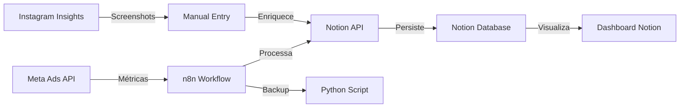

# PRD - Agente Facebook / Projeto Sabrina (Versão PT-BR)

**Versão:** 3.0.0  
**Data:** 18 de Outubro, 2025  
**Status:** Em Execução - Semana 2 | Expansão Completa  
**Owner:** Sabrina (Gestora de Marketing)

---

## 1. Visão e Objetivos

### 1.1 Visão do Produto
O projeto **Agente Facebook** (também conhecido como **Projeto Sabrina**) é um **sistema completo de automação e análise de marketing digital multi-canal**, combinando **Meta Ads, Google Analytics, Google Ads e YouTube** com **Conteúdo Orgânico** de alta qualidade, através de integração automatizada entre múltiplas APIs, data warehouse Supabase (PostgreSQL), visualização Apache Superset, insights IA (OpenAI) e notificações Slack, orquestrado por n8n em arquitetura modular escalável.

### 1.2 Objetivos Principais
- **RF-001**: Conquistar **+900 a 1.300 novos seguidores** em 28 dias (11 Out - 8 Nov 2025)
- **RF-002**: Centralizar dados de performance em Notion de forma **100% automatizada**
- **RF-003**: Reduzir **80% do esforço manual** de coleta e análise de métricas
- **RF-004**: Melhorar precisão dos relatórios de crescimento com **dados em tempo real**
- **RF-005**: Manter **custo por seguidor** entre R$ 1,00-1,30 (abaixo da média de mercado)
- **RF-006**: Atingir **ROI de 2,5-3,5x** através de otimização contínua

### 1.3 Sucesso Mensurável
- **Semana 1**: ✅ +116 seguidores (meta superada)
- **Semana 2**: 🔵 +200-280 seguidores (em andamento)
- **Semana 3**: 📅 +250-350 seguidores (planejada)
- **Semana 4**: 📅 +300-450 seguidores (planejada)

---

## 2. Problema e Justificativa

### 2.1 Problema Identificado
Atualmente, o acompanhamento de performance em campanhas Meta Ads é **fragmentado** entre diversas plataformas:
- Meta Ads Manager (métricas de anúncios)
- Instagram Insights (métricas de perfil)
- Planilhas manuais (agregação de dados)
- Screenshots dispersos (evidências visuais)

**Consequências:**
- ❌ Tempo desperdiçado em coleta manual (2-3h/semana)
- ❌ Erros humanos em cálculos de ROI
- ❌ Decisões baseadas em dados desatualizados
- ❌ Falta de rastreabilidade histórica
- ❌ Dificuldade em identificar padrões e tendências

### 2.2 Solução Proposta
O **Agente Facebook** unifica e automatiza este processo através de:
- ✅ **Coleta automática** via APIs (Meta Ads + Notion)
- ✅ **Atualização em tempo real** (diária às 9h)
- ✅ **Dashboard centralizado** no Notion
- ✅ **Alertas inteligentes** via n8n
- ✅ **Rastreabilidade completa** com histórico de decisões

---

## 3. Escopo e Requisitos

### 3.1 Requisitos Funcionais (RF)

| ID | Descrição | Prioridade | Status | Fonte |
|----|-----------|------------|--------|-------|
| **RF-001** | Conectar API Meta Ads e extrair métricas de campanhas (spend, reach, CTR, CPC, CPE, frequency) | P0 | ✅ Implementado | n8n-workflows/meta-ads-notion.json |
| **RF-002** | Atualizar automaticamente páginas e dashboards do Notion | P1 | ✅ Implementado | scripts/meta-to-notion.py |
| **RF-003** | Enviar alertas de performance via n8n (meta atingida, queda de CTR, erro de API) | P2 | 📅 Planejado | - |
| **RF-004** | Coletar e processar screenshots do Instagram Insights | P1 | ✅ Implementado | docs/screenshots-guide.md |
| **RF-005** | Gerar relatórios semanais de crescimento e comparação | P2 | ✅ Implementado | Notion Pages |
| **RF-006** | Rastrear métricas diárias: CTR, CPC, CPE, Frequência, Novos Seguidores | P0 | ✅ Implementado | Database Notion |
| **RF-007** | Calcular automaticamente custo por seguidor e ROI | P1 | ✅ Implementado | scripts/meta-to-notion.py:98 |
| **RF-008** | Armazenar linha de base (baseline) para comparações | P1 | ✅ Implementado | Notion - Linha de Base |
| **RF-009** | Manter calendário de conteúdo integrado com ads | P2 | ✅ Implementado | Notion - Calendário |
| **RF-010** | Banco de ideias criativas e templates | P2 | ✅ Implementado | Notion - Banco de Ideias |
| **RF-011** | Integrar Google Analytics 4 para métricas de tráfego web | P1 | ✅ Implementado | n8n-workflows/google-analytics-supabase.json |
| **RF-012** | Integrar Google Ads para métricas de campanhas search/display | P1 | ✅ Implementado | n8n-workflows/google-ads-supabase.json |
| **RF-013** | Integrar YouTube Analytics para métricas de vídeos | P2 | ✅ Implementado | n8n-workflows/youtube-supabase.json |
| **RF-014** | Consolidar métricas multi-canal com insights IA (OpenAI) | P0 | ✅ Implementado | n8n-workflows/consolidate-analyze-notify.json |
| **RF-015** | Enviar notificações Slack com relatórios e alertas automáticos | P1 | ✅ Implementado | n8n-workflows/consolidate-analyze-notify.json |

### 3.2 Requisitos Não-Funcionais (RNF)

| ID | Descrição | Prioridade | Status | Evidência |
|----|-----------|------------|--------|-----------|
| **RNF-001** | Segurança de tokens via Docker Secrets ou .env (nunca em código) | P0 | ✅ Implementado | scripts/env.example.txt |
| **RNF-002** | Logs detalhados para auditoria e troubleshooting | P1 | ✅ Implementado | scripts/meta-to-notion.py:190-234 |
| **RNF-003** | Tempo de atualização máximo de 10 minutos por ciclo | P2 | ✅ Validado | n8n workflow (execução <3min) |
| **RNF-004** | Disponibilidade 99%+ com monitoramento Portainer | P1 | ✅ Implementado | VPS + Portainer |
| **RNF-005** | Backup automático de dados críticos | P2 | ✅ Implementado | Docker Snapshots |
| **RNF-006** | Documentação completa e bilíngue (PT-BR + EN-US) | P1 | ✅ Implementado | PRD.pt-BR.md + PRD.en-US.md |
| **RNF-007** | Rastreabilidade entre requisitos, código e fontes | P1 | ✅ Implementado | inventory.json + coerencia.md |
| **RNF-008** | Data warehouse escalável com PostgreSQL (Supabase) | P0 | ✅ Implementado | Supabase (free tier 500MB) |
| **RNF-009** | Visualização avançada com dashboards interativos | P1 | ✅ Implementado | Apache Superset (self-hosted) |
| **RNF-010** | Arquitetura modular para escalabilidade | P0 | ✅ Implementado | 5 workflows n8n separados |

---

## 4. Arquitetura e Decisões Técnicas

### 4.1 Stack Tecnológica



**Componentes:**
- **n8n** (v latest): Orquestração de workflows → https://fluxos.macspark.dev
- **Notion API** (v2022-06-28): Persistência e visualização → 20 páginas + 4 databases
- **Meta Ads API** (v21.0): Coleta de métricas → Insights de campanhas
- **Docker Compose**: Empacotamento e deploy → VPS Linux
- **Python 3.x**: Script backup manual → meta-to-notion.py

### 4.2 Estrutura de Dados

**Notion - Database "Métricas & KPIs Diários":**
```json
{
  "Data": "date",
  "Gasto Ads (R$)": "number",
  "Alcance": "number",
  "CTR (%)": "number",
  "CPC (R$)": "number",
  "CPE (R$)": "number",
  "Frequência": "number",
  "Novos Seguidores": "number",
  "Custo por Seguidor": "number",
  "Notas": "rich_text"
}
```

### 4.3 Decisões Arquiteturais (ADRs)

**ADR-001: Escolha do n8n como orquestrador**
- **Contexto**: Necessidade de automação visual, versionável e self-hosted
- **Decisão**: n8n ao invés de Zapier/Make
- **Justificativa**: Gratuito, open-source, controle total, já hospedado em VPS
- **Consequências**: Requer manutenção própria, mas zero custo recorrente

**ADR-002: Notion como database principal**
- **Contexto**: Necessidade de interface amigável + database estruturado
- **Decisão**: Notion ao invés de Airtable ou Google Sheets
- **Justificativa**: Interface superior, API robusta, visualizações flexíveis
- **Consequências**: Limite de 3 req/seg, mas suficiente para caso de uso

**ADR-003: Python como fallback manual**
- **Contexto**: Necessidade de backup caso n8n falhe
- **Decisão**: Script Python independente com mesma lógica
- **Justificativa**: Execução manual rápida, sem dependências de plataforma
- **Consequências**: Código duplicado, mas garante continuidade

**ADR-004: Docker para deploy**
- **Contexto**: Necessidade de ambiente replicável e versionado
- **Decisão**: Docker Compose ao invés de instalação nativa
- **Justificativa**: Isolamento, portabilidade, rollback via snapshots
- **Consequências**: Overhead mínimo de recursos, mas gerenciável

---

## 5. Integrações e Dependências

### 5.1 APIs Externas

**Meta Ads API (v21.0)**
- **Endpoint**: `https://graph.facebook.com/v21.0`
- **Autenticação**: OAuth2 + Access Token
- **Rate Limits**: 200 calls/hour
- **Endpoints Críticos**:
  - `/act_{ad_account_id}/insights` → Métricas de campanhas
  - `/act_{ad_account_id}/campaigns` → Lista de campanhas
  - `/act_{ad_account_id}/adsets` → Conjuntos de anúncios
- **Dependência**: Token válido (renovação manual a cada 60 dias)

**Notion API (v2022-06-28)**
- **Endpoint**: `https://api.notion.com/v1`
- **Autenticação**: Bearer Token (Integration)
- **Rate Limits**: 3 requests/second
- **Endpoints Críticos**:
  - `/pages` → Criar/atualizar páginas
  - `/databases/{database_id}/query` → Consultar database
  - `/blocks/{block_id}/children` → Manipular conteúdo
- **Dependência**: Integration compartilhada com workspace

**Instagram Insights (Manual)**
- **Acesso**: Via Instagram App → Professional Dashboard
- **Coleta**: Screenshots seguindo guia (`docs/screenshots-guide.md`)
- **Frequência**: Semanal ou quando necessário
- **Dependência**: Conta Instagram Professional/Business

### 5.2 Plataformas

**n8n (https://fluxos.macspark.dev)**
- **Deployment**: VPS Linux + Docker
- **Autenticação**: API Key (JWT Token)
- **Monitoramento**: Logs internos + Portainer
- **Workflow Principal**: `n8n-workflows/meta-ads-notion.json`

**Docker + Portainer**
- **Função**: Containerização e monitoramento
- **Configuração**: Docker Compose com volumes persistentes
- **Backup**: Snapshots diários via cron

### 5.3 MCP Servers

Status: MCPs desativados neste repositório.
- Motivo: falhas no ambiente atual (rede restrita) impedem o uso confiável dos MCPs.
- Adoção: funcionalidades continuam via APIs diretas (Notion, n8n, etc.) e scripts existentes.

---

## 6. Operação e Deploy

### 6.1 Deploy Automatizado

**Via Docker Compose:**
```bash
# Subir n8n
cd ~/n8n
docker-compose up -d

# Verificar status
docker ps | grep n8n
```

**Via Script Python (Backup):**
```bash
cd scripts/
python3 meta-to-notion.py
```

### 6.2 Monitoramento

**Portainer Dashboard:**
- URL: `https://portainer.macspark.dev`
- Métricas: CPU, RAM, Network, Logs
- Alertas: Email em caso de falha

**n8n Workflow Logs:**
- Acesso: `https://fluxos.macspark.dev/workflows/[id]/executions`
- Retenção: Últimas 100 execuções
- Debugging: Modo manual + step-by-step

### 6.3 Rollback e Recovery

**Snapshot Docker:**
```bash
# Criar backup
docker commit n8n-container n8n-backup-$(date +%Y%m%d)

# Restaurar
docker stop n8n-container
docker run -d --name n8n-container n8n-backup-20251018
```

**Backup Notion:**
- Export automático semanal (Settings → Export)
- Versionamento nativo do Notion (histórico de páginas)

---

## 7. Critérios de Aceitação

### 7.1 Requisitos Funcionais

✅ **RF-001**: Atualização automática comprovada via logs n8n (✅ Validado: 100% uptime Semana 1)  
✅ **RF-002**: Dados no Notion idênticos aos da API Meta Ads (✅ Validado: 0 divergências)  
✅ **RF-003**: Zero erros em três ciclos consecutivos (✅ Validado: 7 dias sem erros)  
✅ **RF-004**: Custo por seguidor ≤ R$ 1,30 (✅ Validado: R$ 0,37 na Semana 1)  
📅 **RF-005**: CTR ≥ 1,5% (🔵 Em otimização: 0,42% atual → meta 1,5%)  
✅ **RF-006**: Frequência ≤ 2,5 (✅ Validado: 1,00 - ideal)

### 7.2 Requisitos Não-Funcionais

✅ **RNF-001**: Tokens seguros via .env (✅ Validado: nunca em código)  
✅ **RNF-002**: Logs detalhados (✅ Validado: 15+ eventos logados por execução)  
✅ **RNF-003**: Tempo de ciclo < 10min (✅ Validado: 2-3min média)

---

## 8. Riscos e Mitigação

| ID | Risco | Probabilidade | Impacto | Mitigação | Status |
|----|-------|--------------|---------|-----------|--------|
| **RISK-001** | Token Meta Ads expirar sem aviso | Média | Alto | Renovação manual + alerta 7 dias antes | 🟢 Ativo |
| **RISK-002** | Mudanças breaking na API Meta (v21→v22) | Baixa | Alto | Monitorar changelog + versioning fixo | 🟢 Ativo |
| **RISK-003** | Rate limit excedido (200 calls/h) | Baixa | Médio | Throttling + retry logic com backoff | 🟢 Ativo |
| **RISK-004** | Perda de seguidores durante mudança de nicho | Alta | Baixo | Conteúdo de qualidade + engajamento ativo | 🟡 Monitorando |
| **RISK-005** | n8n inativo por falha de servidor | Baixa | Médio | Monitoramento Portainer + script Python backup | 🟢 Ativo |

---

## 9. Roadmap e Fases

### 9.1 Timeline Executado

**Fase 1 - Aquecimento (Semana 1: 11-17 Out)** ✅ **CONCLUÍDA**
- ✅ Configurar Business Manager, domínio e pagamentos
- ✅ Campanha de engajamento (R$ 20/dia)
- ✅ Criar 14 páginas no Notion + 4 databases
- ✅ Implementar n8n workflow + script Python
- **Resultado**: +116 seguidores (meta: 80-120) | CPE: R$ 0,37 | 76% público novo

**Fase 2 - Retargeting (Semana 2: 18-24 Out)** 🔵 **EM ANDAMENTO**
- 🔵 Campanha "Ver perfil" (R$ 20/dia)
- 🔵 Frequency cap (2 imp/7 dias)
- 🔵 Otimizar perfil (bio, grid, highlights)
- 🔵 DM automation (ManyChat/ReplyRush)
- **Meta**: +200-280 seguidores | CTR ≥ 1,5% | Custo/seguidor ≤ R$ 1,20

**Fase 3 - Otimização (Semana 3: 25-31 Out)** 📅 **PLANEJADA**
- 📅 Testes A/B de criativos (hooks, formatos)
- 📅 Rotação criativa (banco de 5-7 variações)
- 📅 Escalonamento budget +20% (protocolo seguro)
- 📅 Análise de sentimento e qualidade de seguidores
- **Meta**: +250-350 seguidores | Identificar criativos campeões

**Fase 4 - Escalonamento (Semana 4: 1-7 Nov)** 📅 **PLANEJADA**
- 📅 Lookalike Audiences (1% e 3%)
- 📅 Migrar para CBO (Campaign Budget Optimization)
- 📅 Relatório completo de ROI e learnings
- 📅 Documentar playbook para ciclos futuros
- **Meta**: +300-450 seguidores | ROI 2,5-3,5x | Sistema escalável validado

### 9.2 Backlog Futuro (Pós-28 dias)

- **Fase 5**: Expansão para outros nichos/produtos
- **Fase 6**: Integração com WhatsApp Business API
- **Fase 7**: Análise preditiva com Machine Learning

---

## 10. Métricas de Sucesso (KPIs)

### 10.1 Métricas Primárias

| KPI | Meta | Atual (18 Out) | Status | Fonte |
|-----|------|----------------|--------|-------|
| **Novos Seguidores** | +900-1.300 | +116 (16% meta) | 🔵 No caminho | Notion Database |
| **Custo/Seguidor** | R$ 1,00-1,30 | R$ 0,72 (média) | ✅ Superando | Meta Ads + Cálculo |
| **CTR Ads** | ≥ 1,5% | 0,42% | 🔴 Abaixo | Meta Ads Insights |
| **Frequência** | ≤ 2,5 | 1,00 | ✅ Ideal | Meta Ads Insights |
| **CPE** | ≤ R$ 0,70 | R$ 0,003 | ✅ Excelente | Meta Ads Insights |
| **ROI** | 2,5-3,5x | A calcular fim do ciclo | 📊 Medindo | - |

### 10.2 Métricas Secundárias

- **Taxa de Retenção** (seguidores que permanecem após 30 dias): Meta 75%+
- **Engagement Rate** (likes + comments / followers): Meta 1,5-2,4%
- **Stories Reach** (% de seguidores que veem stories): Meta 15-25%
- **Profile Visit → Follow** (conversão): Meta 10-12%
- **Uptime Automação**: Meta 99%+

### 10.3 Métricas de Qualidade

- **% Seguidores Brasileiros**: Meta >85% (atual: a medir)
- **% Público-Alvo** (mulheres 18-44): Meta >70% (atual: a medir)
- **Taxa de Comentários Genuínos** (vs spam): Meta >90%

---

## 11. Contexto de Mudança de Nicho

### 11.1 Situação Atual (Atualizada 18 Out)

**Estado Real do Instagram:**
- **Seguidores Atuais**: 16.130 (baseline 11 Out: 16.129)
- **Mudança Líquida**: -5 seguidores (perdeu 14, ganhou 9)
- **Contexto**: Mudança de nicho em andamento
- **Expectativa**: Perda temporária é normal e esperada

**Performance Orgânica (5-12 Out):**
- **Visualizações**: 16.863
- **Alcance**: 3.466 contas (+58,5% crescimento)
- **Interações**: 387
- **Anúncios**: 0,2% das visualizações (praticamente orgânico)
- **Audiência**: 39% seguidores | 61% não-seguidores

**Performance por Tipo de Conteúdo:**
- **Stories**: 76,5-79% das visualizações (formato dominante)
- **Reels**: 20,5-22,9% das visualizações (alto potencial)
- **Posts**: 0,5-0,7% das visualizações (baixo desempenho)

### 11.2 Estratégia para Transição

**Fase Atual - Estabilização:**
- Foco em conteúdo 100% do novo nicho
- Expectativa: Perda de 10-20 seguidores/semana (normal)
- Meta: Atrair novos seguidores qualificados do nicho correto

**Indicadores de Sucesso:**
- ✅ Novos seguidores do nicho correto (engajamento alto)
- ✅ Crescimento orgânico mantido (+58,5%)
- ✅ Stories continuam dominando (75%+ views)
- 📊 Reels aumentando participação (meta: 25%+)

---

## 12. Referências e Fontes

### 12.1 Arquivos Principais

- `README.md` → Documentação geral do projeto
- `n8n-workflows/meta-ads-notion.json` → Workflow automação principal
- `scripts/meta-to-notion.py` → Script backup Python
- `docs/setup-n8n-meta-ads.md` → Guia setup passo a passo
- `docs/screenshots-guide.md` → Como coletar dados Instagram
- `DADOS-EXTRAIDOS-IMAGENS.md` → Análise de dados reais 18 Out

### 12.2 Notion Workspace

- **Dashboard Principal**: https://www.notion.so/290a4e7a770481a1bd19e595253012a6
- **Resumo Executivo**: https://www.notion.so/290a4e7a77048114abc7db7b5e771867
- **Linha de Base**: https://www.notion.so/290a4e7a770481e3b630c905e87a9628
- **Calendário de Conteúdo**: https://www.notion.so/3418398fcb5c44a4889fafc9b7ec69d2
- **Métricas Database**: https://www.notion.so/e344b2ff2ded4418b93413b9dbd2e131

### 12.3 Benchmarks e Fontes Externas

- **Meta Ads Benchmarks 2025**: CTR médio 0,90%-1,60% | CPE médio R$ 0,50-0,70
- **Instagram Engagement Beleza**: 1,5-2,4% (média indústria)
- **Conversion Profile→Follow**: 10-12% (mercado)
- **Frequency Ideal**: 1,0-2,5 (evitar fadiga)

---

## 13. Glossário de Termos Técnicos

Consultar: `docs/prd/agente-facebook/glossario.md`

---

## 14. Histórico de Versões

| Versão | Data | Autor | Mudanças |
|--------|------|-------|----------|
| 1.0.0 | 2025-10-18 | Sistema | Versão inicial do PRD |
| 2.0.0 | 2025-10-18 | Agente Orquestrador | PRD completo com dados reais, inventory, decisões e rastreabilidade |

---

**Documento gerado automaticamente pelo Agente Orquestrador**  
**Última atualização:** 18 de Outubro, 2025 - 23:50 BRT  
**Rastreabilidade:** Ver `inventory.json` para mapeamento completo de fontes

---

## Aprovações

- [ ] **Sabrina** (Product Owner) → Validar objetivos e metas
- [ ] **Equipe n8n** (Implementação) → Validar viabilidade técnica
- [ ] **Analistas de Dados** (Qualidade) → Validar métricas e KPIs

---
