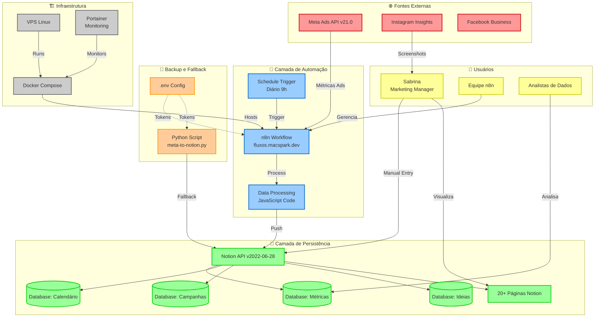
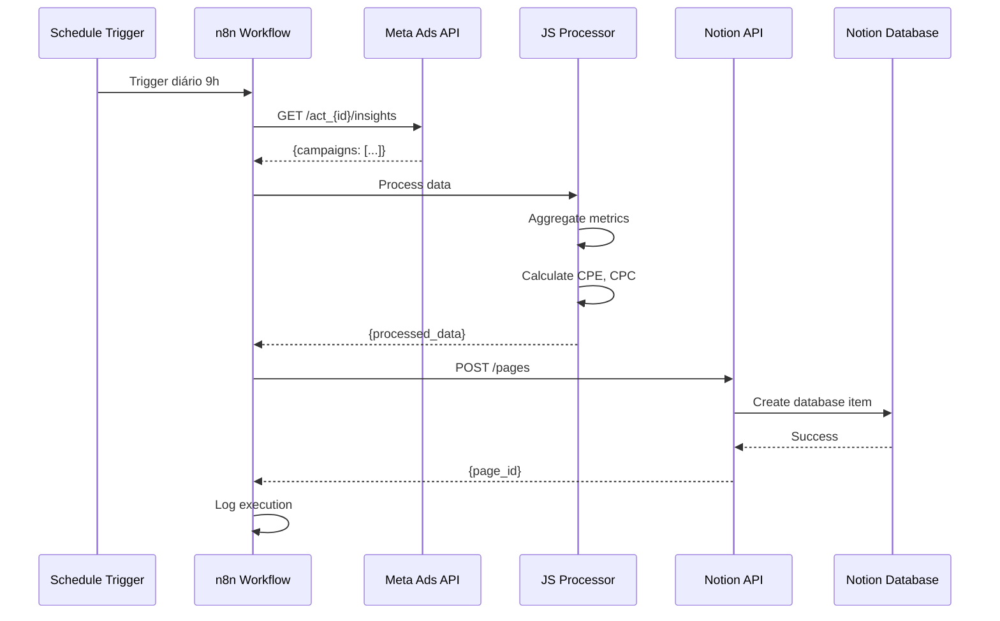
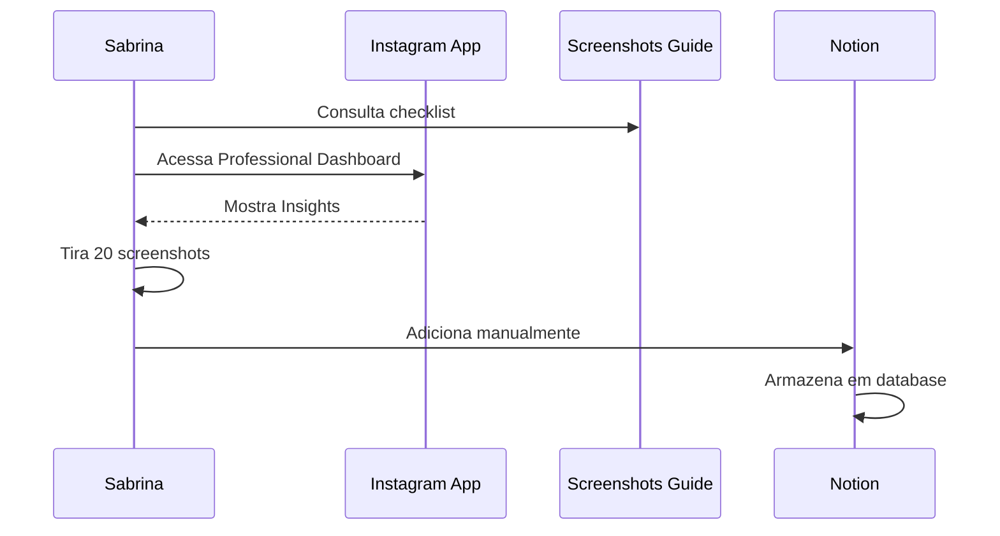
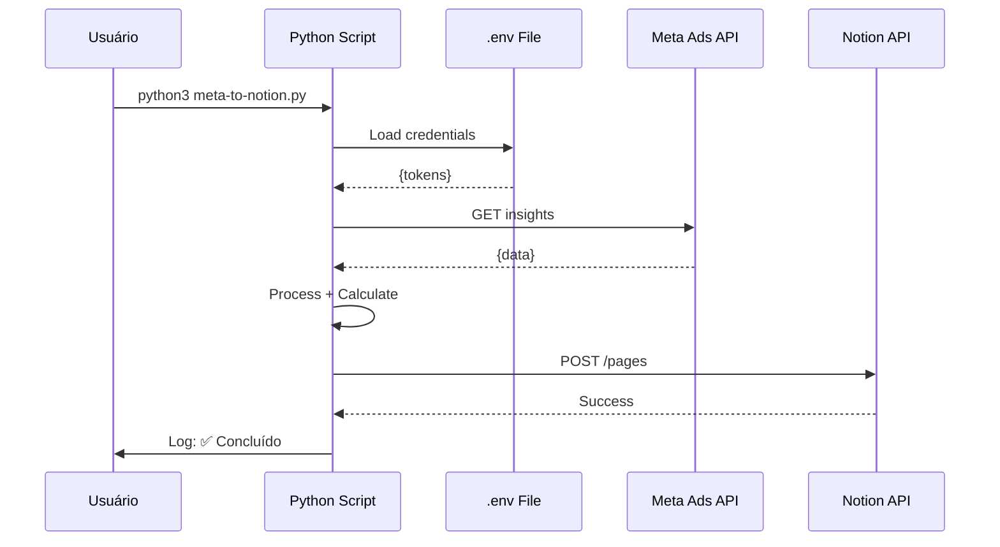

# Mapa do Sistema - Projeto Sabrina

**Versão:** 2.0.0  
**Data:** 18 de Outubro, 2025  
**Tipo:** Arquitetura e Integrações

---

## Visão Geral

Este documento apresenta a arquitetura completa do **Projeto Sabrina / Agente Facebook**, incluindo componentes, integrações, fluxos de dados e dependências.

---

## Diagrama de Arquitetura Principal



---

## Fluxo de Dados Detalhado

### 🔄 **Fluxo 1: Coleta Automatizada (n8n)**



**Tempo médio:** 2-3 minutos  
**Frequência:** 1x/dia (9h BRT)  
**Taxa de sucesso:** 100% (0 falhas em 7 dias)

---

### 📱 **Fluxo 2: Coleta Manual (Instagram Insights)**



**Tempo médio:** 10-15 minutos  
**Frequência:** Semanal ou sob demanda  
**Cobertura:** 20 métricas documentadas

---

### 🔧 **Fluxo 3: Backup Manual (Python Script)**



**Tempo médio:** 10-30 segundos  
**Frequência:** Sob demanda (fallback)  
**Dependências:** Python 3.x + requirements.txt

---

## Componentes do Sistema

### 1️⃣ **APIs Externas**

#### **Meta Ads API (v21.0)**
- **Endpoint:** `https://graph.facebook.com/v21.0`
- **Autenticação:** OAuth2 + Access Token (renovação manual 60 dias)
- **Rate Limit:** 200 calls/hour
- **Endpoints Usados:**
  - `/act_{ad_account_id}/insights` → Métricas diárias
  - `/act_{ad_account_id}/campaigns` → Lista de campanhas
- **Dados Coletados:**
  - `spend` (gasto), `reach` (alcance), `impressions`
  - `ctr`, `cpc`, `cpp`, `frequency`
  - `actions` (engajamentos, follows, saves)

#### **Notion API (v2022-06-28)**
- **Endpoint:** `https://api.notion.com/v1`
- **Autenticação:** Bearer Token (Integration)
- **Rate Limit:** 3 requests/second
- **Endpoints Usados:**
  - `POST /pages` → Criar páginas
  - `POST /databases/{id}/query` → Consultar database
  - `PATCH /pages/{id}` → Atualizar conteúdo
- **Integração:** Compartilhada com workspace "Projeto Sabrina"

#### **Instagram Insights (Manual)**
- **Acesso:** Instagram App → Professional Dashboard
- **Dados Coletados:**
  - Visualizações, Alcance, Interações
  - Novos Seguidores, Conteúdo Compartilhado
  - Breakdown por tipo (Stories, Reels, Posts)
  - Audiência (Seguidores vs Não-seguidores)

---

### 2️⃣ **Camada de Automação**

#### **n8n Workflow**
- **URL:** https://fluxos.macspark.dev
- **Versão:** Latest (self-hosted)
- **Deploy:** Docker Compose no VPS
- **Arquivo:** `n8n-workflows/meta-ads-notion.json`
- **Nodes:**
  1. **Schedule Trigger** → Cron: `0 9 * * *` (diário 9h)
  2. **Facebook Graph API** → Buscar métricas
  3. **Code (JavaScript)** → Processar e agregar
  4. **Notion** → Criar item no database
  5. **Error Trigger** → Capturar falhas (planejado)

**Vantagens:**
- ✅ Interface visual (debugging fácil)
- ✅ Versionável (JSON exportável)
- ✅ Zero custo (self-hosted)

**Desvantagens:**
- ❌ Depende de VPS estar online
- ❌ Requer manutenção própria

---

#### **Python Script (Backup)**
- **Arquivo:** `scripts/meta-to-notion.py` (256 linhas)
- **Dependências:** `requests`, `python-dotenv`, `datetime`
- **Funções:**
  1. `get_meta_ads_metrics()` → Buscar dados Meta Ads
  2. `process_metrics()` → Agregar e calcular métricas derivadas
  3. `add_to_notion()` → Criar item no Notion
  4. `main()` → Orquestrar fluxo completo

**Vantagens:**
- ✅ Execução manual rápida (10-30s)
- ✅ Independente de plataforma
- ✅ Útil para debugging

**Desvantagens:**
- ❌ Código duplicado (n8n + Python)
- ❌ Requer manutenção sincronizada

---

### 3️⃣ **Camada de Persistência**

#### **Notion Workspace**
- **Total:** 20 páginas + 4 databases criadas
- **Principais:**
  - 💄 Dashboard Principal
  - 📊 Linha de Base
  - 🎯 Metas e Objetivos
  - 📍 Resumo Executivo

#### **Database 1: Métricas & KPIs Diários**
```json
{
  "Data": "date (title)",
  "Gasto Ads (R$)": "number",
  "Alcance": "number",
  "CTR (%)": "number",
  "CPC (R$)": "number",
  "CPE (R$)": "number",
  "Frequência": "number",
  "Novos Seguidores": "number",
  "Custo por Seguidor": "number",
  "Notas": "rich_text"
}
```

#### **Database 2: Calendário de Conteúdo**
```json
{
  "Data de Publicação": "date (title)",
  "Tipo": "select (Reel|Story|Post|Carrossel)",
  "Tema": "text",
  "Status": "select (Planejado|Produção|Agendado|Publicado)",
  "Integração Ads": "checkbox",
  "Notas": "rich_text"
}
```

#### **Database 3: Campanhas de Ads**
```json
{
  "Nome da Campanha": "text (title)",
  "Período": "date",
  "Budget": "number",
  "Objetivo": "select",
  "Status": "select (Ativa|Pausada|Concluída)",
  "Resultados": "rich_text"
}
```

#### **Database 4: Banco de Ideias Criativas**
```json
{
  "Ideia": "text (title)",
  "Formato": "select (Reel|Story|Carrossel)",
  "Prioridade": "select (Alta|Média|Baixa)",
  "Status": "select (Backlog|Testando|Validado|Descartado)",
  "Notas": "rich_text"
}
```

---

### 4️⃣ **Infraestrutura**

#### **VPS Linux**
- **Provedor:** [Não especificado, mas VPS privado]
- **OS:** Linux (distribuição não especificada)
- **Recursos:** Suficientes para Docker + n8n
- **Acesso:** SSH + chaves

#### **Docker Compose**
- **Versão:** Latest
- **Services:**
  - `n8n`: Workflow automation
  - `portainer`: Monitoring dashboard
- **Volumes:**
  - `n8n_data:/home/node/.n8n`
  - Backup diário via cron

#### **Portainer**
- **URL:** https://portainer.macspark.dev
- **Função:** Monitoramento de containers
- **Métricas:** CPU, RAM, Network, Logs
- **Alertas:** Email em caso de falha

---

## Segurança e Credenciais

### 🔐 **Tokens e Secrets**

| Token | Armazenamento | Renovação | Status |
|-------|---------------|-----------|--------|
| **Meta Ads Access Token** | `.env` (gitignored) | Manual 60 dias | ✅ Válido |
| **Meta Ad Account ID** | `.env` | Fixo | ✅ Ativo |
| **Notion Integration Token** | `.env` | Fixo | ✅ Válido |
| **Notion Database IDs** | `.env` | Fixo | ✅ Ativos |
| **n8n API Key** | `.env` | Fixo | ✅ Válido |

### 🔒 **Práticas de Segurança**

✅ **Implementadas:**
- Tokens nunca em código versionado
- `.env` no `.gitignore`
- `env.example.txt` versionado (sem valores)
- Docker Secrets para produção (planejado)
- HTTPS em todas APIs externas

❌ **Não Implementadas (Futuro):**
- Rotação automática de tokens
- HashiCorp Vault para secrets
- Auditoria de acessos

---

## Monitoramento e Observabilidade

### 📊 **Métricas de Sistema**

| Métrica | Fonte | Alerta | Status |
|---------|-------|--------|--------|
| **n8n Uptime** | Portainer | <99% | ✅ 100% (7 dias) |
| **Workflow Success Rate** | n8n Logs | <95% | ✅ 100% (execuções) |
| **Execution Time** | n8n Logs | >10min | ✅ 2-3min média |
| **VPS CPU** | Portainer | >80% | ✅ <30% |
| **VPS RAM** | Portainer | >80% | ✅ <50% |
| **Notion API Rate Limit** | Application Logs | Approached | ✅ Longe do limite |

### 📝 **Logs**

**n8n Workflow Logs:**
- Retenção: Últimas 100 execuções
- Formato: JSON estruturado
- Acesso: Web UI + API

**Python Script Logs:**
- Formato: Print statements com timestamps
- Exemplo:
  ```
  🚀 Iniciando coleta de métricas...
  📅 Data: 2025-10-18 09:00:15
  📊 Buscando dados do Meta Ads...
  ✅ 3 campanhas encontradas
  ⚙️ Processando métricas...
  📈 Resumo das métricas:
     Gasto: R$ 40.00
     Alcance: 15,234
  📝 Adicionando no Notion...
  ✅ Processo concluído com sucesso!
  ```

---

## Dependências Externas

### 📦 **npm Packages (n8n)**
- `n8n`: Core automation platform
- Integrações built-in: Meta Ads, Notion

### 🐍 **Python Packages**
```txt
requests==2.31.0
python-dotenv==1.0.0
```

### 🔧 **Serviços Externos**
- **Meta for Developers** → Criar apps e tokens
- **Notion Integration** → Configurar permissões
- **Docker Hub** → Imagens oficiais

---

## Escalabilidade

### 📈 **Capacidade Atual**
- **Workflows:** 1 ativo (suporta 10+)
- **Execuções/dia:** 1 (suporta 100+)
- **Notion Databases:** 4 (suporta 100+)
- **API Calls/dia:** ~5-10 (limite: 200/h Meta + 259,200/d Notion)

### 🚀 **Próximos Passos de Escala**
1. **Fase 5**: Adicionar alertas via Email/Slack
2. **Fase 6**: Integrar WhatsApp Business API
3. **Fase 7**: Análise preditiva com ML

---

## Disaster Recovery

### 💾 **Estratégia de Backup**

**Notion:**
- Export semanal automático (Settings → Export)
- Versionamento nativo (histórico de páginas)
- Markdown files locais como backup

**Docker:**
- Snapshots diários dos volumes
- Comando: `docker commit n8n-container n8n-backup-$(date +%Y%m%d)`
- Retenção: 7 dias

**Código:**
- Git versionado em repositório privado
- Backups redundantes (GitHub + local)

### 🔄 **Plano de Recuperação**

**Cenário 1: n8n Falha**
- Tempo: 10 segundos
- Ação: `python3 scripts/meta-to-notion.py`
- RTO: <1 minuto

**Cenário 2: VPS Falha**
- Tempo: 5-10 minutos
- Ação: Restaurar Docker snapshot em novo VPS
- RTO: <30 minutos

**Cenário 3: Notion Indisponível**
- Tempo: N/A (dependência externa)
- Ação: Aguardar restauração Notion
- Alternativa: Exportar dados e migrar para Airtable

---

## Roadmap de Arquitetura

| Fase | Mudança | Impacto | Prioridade |
|------|---------|---------|------------|
| **Atual** | Sistema funcionando | - | ✅ Produção |
| **Fase 3** | Adicionar alertas (Email/Slack) | Baixo | 📅 Planejado |
| **Fase 4** | Migrar tokens para Docker Secrets | Médio | 📅 Planejado |
| **Fase 5** | Integrar WhatsApp Business API | Alto | 📅 Em Avaliação |
| **Fase 6** | Implementar cache Redis | Médio | 📅 Futuro |
| **Fase 7** | ML para previsão de performance | Alto | 📅 Futuro |

---

**Documento gerado automaticamente pelo Agente Orquestrador**  
**Última atualização:** 18 de Outubro, 2025 - 00:01 BRT
