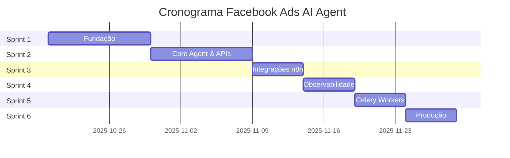

# 📅 PLANO DE EXECUÇÃO - SPRINTS DETALHADOS
## Facebook Ads AI Agent - Cronograma de Implementação

---

## 🎯 VISÃO GERAL

| Métrica | Valor |
|---------|-------|
| **Duração Total** | 8 semanas (2 meses) |
| **Número de Sprints** | 6 sprints |
| **Equipe Sugerida** | 2 Backend Devs + 1 DevOps |
| **Horas Totais Estimadas** | ~480 horas |
| **Complexidade** | 🟠 Média-Alta |
| **Risco** | 🟡 Controlado |

---

## 📋 SPRINT 1: FUNDAÇÃO (Semana 1-2)

**Objetivo:** Criar estrutura base executável com FastAPI funcionando

**Duração:** 10 dias úteis  
**Horas Estimadas:** 80h  
**Prioridade:** 🔴 CRÍTICA  

### Tarefas

| # | Tarefa | Responsável | Horas | Status |
|---|--------|-------------|-------|--------|
| **1.1** | **Estrutura de Diretórios** | Backend Dev 1 | 4h | ⏳ |
| 1.1.1 | Criar estrutura src/ completa | | 2h | |
| 1.1.2 | Criar estrutura tests/ (unit/integration/e2e) | | 1h | |
| 1.1.3 | Criar diretórios config/, scripts/, logs/, data/ | | 1h | |
| **1.2** | **Dependências e Configuração** | Backend Dev 1 | 8h | ⏳ |
| 1.2.1 | Criar requirements.txt com versões fixadas | | 2h | |
| 1.2.2 | Criar requirements-dev.txt | | 1h | |
| 1.2.3 | Criar src/utils/config.py (Pydantic Settings) | | 2h | |
| 1.2.4 | Criar .env.example com template completo | | 1h | |
| 1.2.5 | Criar src/utils/logger.py (logging estruturado) | | 2h | |
| **1.3** | **Database Setup** | Backend Dev 1 | 12h | ⏳ |
| 1.3.1 | Criar src/utils/database.py (SQLAlchemy async) | | 3h | |
| 1.3.2 | Criar modelos em src/models/ (Campaign, Insight, User, etc.) | | 6h | |
| 1.3.3 | Criar schemas Pydantic em src/schemas/ | | 3h | |
| **1.4** | **FastAPI Main** | Backend Dev 2 | 10h | ⏳ |
| 1.4.1 | Criar main.py com aplicação FastAPI básica | | 3h | |
| 1.4.2 | Configurar CORS, middleware, exception handlers | | 2h | |
| 1.4.3 | Criar endpoint /health e / (root) | | 1h | |
| 1.4.4 | Integrar Prometheus metrics (/metrics) | | 2h | |
| 1.4.5 | Configurar Swagger/ReDoc docs | | 2h | |
| **1.5** | **Docker e Orquestração** | DevOps | 20h | ⏳ |
| 1.5.1 | Criar Dockerfile multi-stage otimizado | | 4h | |
| 1.5.2 | Criar docker-compose.yml (dev) com todos serviços | | 6h | |
| 1.5.3 | Criar docker-compose.prod.yml com Traefik | | 4h | |
| 1.5.4 | Configurar Prometheus (config/prometheus.yml) | | 2h | |
| 1.5.5 | Configurar Grafana datasources | | 2h | |
| 1.5.6 | Testar stack completa localmente | | 2h | |
| **1.6** | **Módulos Utilitários** | Backend Dev 1 | 12h | ⏳ |
| 1.6.1 | Mover e adaptar api_client.py para src/utils/ | | 3h | |
| 1.6.2 | Mover e adaptar token_manager.py para src/utils/ | | 3h | |
| 1.6.3 | Mover e adaptar context_memory.py para src/utils/ | | 3h | |
| 1.6.4 | Criar src/utils/cache.py (wrapper Redis) | | 3h | |
| **1.7** | **Alembic Migrations** | Backend Dev 2 | 8h | ⏳ |
| 1.7.1 | Inicializar Alembic (alembic init) | | 1h | |
| 1.7.2 | Configurar alembic.ini e env.py | | 2h | |
| 1.7.3 | Criar migration inicial do schema | | 3h | |
| 1.7.4 | Testar upgrade/downgrade | | 2h | |
| **1.8** | **Validação e Testes** | Time | 6h | ⏳ |
| 1.8.1 | Executar make docker-up e validar todos serviços | | 2h | |
| 1.8.2 | Acessar http://localhost:8000/docs (Swagger) | | 1h | |
| 1.8.3 | Validar /health retorna 200 OK | | 1h | |
| 1.8.4 | Validar Prometheus coletando métricas | | 1h | |
| 1.8.5 | Validar Grafana acessível | | 1h | |

### Entregas Sprint 1
- ✅ Estrutura de diretórios completa conforme blueprint
- ✅ requirements.txt com todas dependências versionadas
- ✅ main.py com FastAPI funcional (health check, docs)
- ✅ docker-compose.yml orquestrando 7 serviços (app, postgres, redis, n8n, prometheus, grafana, celery)
- ✅ Alembic migrations funcionando
- ✅ /docs (Swagger) acessível em http://localhost:8000/docs
- ✅ Prometheus coletando métricas básicas
- ✅ Grafana dashboard de system health

### Critérios de Aceite
- [ ] `make docker-up` sobe stack sem erros
- [ ] GET http://localhost:8000/health retorna 200 OK
- [ ] GET http://localhost:8000/docs mostra Swagger UI
- [ ] GET http://localhost:8000/metrics retorna métricas Prometheus
- [ ] PostgreSQL acessível e migrations aplicadas
- [ ] Redis acessível e respondendo PING
- [ ] Grafana acessível em http://localhost:3000

### Riscos Sprint 1
| Risco | Probabilidade | Impacto | Mitigação |
|-------|---------------|---------|-----------|
| Conflitos de porta | 🟢 Baixa | 🟡 Médio | Documentar portas usadas, usar .env |
| Problemas Docker Windows | 🟡 Média | 🟠 Alto | Testar em WSL2, documentar issues |
| Dependências conflitantes | 🟢 Baixa | 🟡 Médio | Usar requirements.txt com versões fixas |

---

## 📋 SPRINT 2: CORE AGENT & APIs (Semana 3-4)

**Objetivo:** Agente Facebook Ads e APIs REST funcionais

**Duração:** 10 dias úteis  
**Horas Estimadas:** 100h  
**Prioridade:** 🔴 CRÍTICA  

### Tarefas

| # | Tarefa | Responsável | Horas | Status |
|---|--------|-------------|-------|--------|
| **2.1** | **Facebook Ads Agent** | Backend Dev 1 | 24h | ⏳ |
| 2.1.1 | Criar src/agents/base_agent.py (classe abstrata) | | 4h | |
| 2.1.2 | Implementar src/agents/facebook_agent.py | | 8h | |
| 2.1.3 | Método get_campaigns() com paginação e filtros | | 3h | |
| 2.1.4 | Método get_campaign_insights() com métricas | | 4h | |
| 2.1.5 | Método process_natural_language_query() (NLP básico) | | 3h | |
| 2.1.6 | Integrar com api_client (rate limiting) | | 2h | |
| **2.2** | **API Router - Campaigns** | Backend Dev 2 | 16h | ⏳ |
| 2.2.1 | Criar src/api/campaigns.py com FastAPI Router | | 2h | |
| 2.2.2 | GET /api/v1/campaigns (listar com filtros) | | 3h | |
| 2.2.3 | GET /api/v1/campaigns/{id} (detalhes) | | 2h | |
| 2.2.4 | GET /api/v1/campaigns/{id}/insights | | 4h | |
| 2.2.5 | PATCH /api/v1/campaigns/{id} (atualizar) | | 3h | |
| 2.2.6 | Testes de integração do router | | 2h | |
| **2.3** | **API Router - Analytics** | Backend Dev 2 | 14h | ⏳ |
| 2.3.1 | Criar src/api/analytics.py | | 2h | |
| 2.3.2 | GET /api/v1/analytics/dashboard | | 4h | |
| 2.3.3 | GET /api/v1/analytics/performance | | 4h | |
| 2.3.4 | GET /api/v1/analytics/trends | | 3h | |
| 2.3.5 | Testes de integração | | 1h | |
| **2.4** | **API Router - Automation** | Backend Dev 1 | 12h | ⏳ |
| 2.4.1 | Criar src/api/automation.py | | 2h | |
| 2.4.2 | POST /api/v1/automation/pause-underperforming | | 4h | |
| 2.4.3 | POST /api/v1/automation/optimize-budgets | | 4h | |
| 2.4.4 | GET /api/v1/automation/suggestions | | 2h | |
| **2.5** | **API Router - Chat** | Backend Dev 2 | 10h | ⏳ |
| 2.5.1 | Criar src/api/chat.py | | 2h | |
| 2.5.2 | POST /api/v1/chat (processar query) | | 4h | |
| 2.5.3 | GET /api/v1/chat/history | | 2h | |
| 2.5.4 | Integrar com context_memory | | 2h | |
| **2.6** | **Performance Analyzer** | Backend Dev 1 | 16h | ⏳ |
| 2.6.1 | Criar src/analytics/performance_analyzer.py | | 4h | |
| 2.6.2 | Implementar cálculo de scores (0-100) | | 4h | |
| 2.6.3 | Implementar detecção de anomalias (baseline) | | 4h | |
| 2.6.4 | Implementar análise de tendências (7/14/30 dias) | | 4h | |
| **2.7** | **Campaign Optimizer** | Backend Dev 1 | 12h | ⏳ |
| 2.7.1 | Criar src/automation/campaign_optimizer.py | | 3h | |
| 2.7.2 | Lógica de pausa por CTR/CPA | | 3h | |
| 2.7.3 | Lógica de ajuste de budget (+/- 20%) | | 3h | |
| 2.7.4 | Lógica de realocação inteligente | | 3h | |
| **2.8** | **Testes Unitários** | Time | 16h | ⏳ |
| 2.8.1 | Atualizar tests/unit/test_facebook_agent.py | | 4h | |
| 2.8.2 | Criar tests/unit/test_performance_analyzer.py | | 4h | |
| 2.8.3 | Criar tests/unit/test_campaign_optimizer.py | | 4h | |
| 2.8.4 | Atingir coverage >80% | | 4h | |

### Entregas Sprint 2
- ✅ FacebookAdsAgent completo e testado
- ✅ 4 routers REST implementados (campaigns, analytics, automation, chat)
- ✅ Performance Analyzer funcional
- ✅ Campaign Optimizer operante
- ✅ Testes unitários com coverage >80%
- ✅ Swagger docs atualizados com todos endpoints

### Critérios de Aceite
- [ ] GET /api/v1/campaigns retorna lista de campanhas
- [ ] GET /api/v1/campaigns/{id}/insights retorna métricas
- [ ] GET /api/v1/analytics/dashboard retorna dashboard completo
- [ ] POST /api/v1/automation/pause-underperforming sugere pausas
- [ ] POST /api/v1/chat processa queries em português
- [ ] `make test-unit` passa com coverage >80%
- [ ] `make lint` sem erros

---

## 📋 SPRINT 3: INTEGRAÇÕES n8n (Semana 5)

**Objetivo:** Automações externas e alertas multi-canal via n8n

**Duração:** 5 dias úteis  
**Horas Estimadas:** 40h  
**Prioridade:** 🟠 ALTA  

### Tarefas

| # | Tarefa | Responsável | Horas | Status |
|---|--------|-------------|-------|--------|
| **3.1** | **n8n Client** | Backend Dev 2 | 8h | ⏳ |
| 3.1.1 | Criar src/integrations/n8n_client.py | | 3h | |
| 3.1.2 | Método trigger_workflow() genérico | | 2h | |
| 3.1.3 | Métodos específicos (send_alert, fetch_metrics, etc.) | | 2h | |
| 3.1.4 | Testes de integração | | 1h | |
| **3.2** | **Workflow 1: fb_fetch_metrics** | DevOps | 8h | ⏳ |
| 3.2.1 | Configurar webhook trigger em n8n | | 2h | |
| 3.2.2 | Node HTTP Request para Facebook API | | 2h | |
| 3.2.3 | Node para processar e transformar dados | | 2h | |
| 3.2.4 | Node para salvar em PostgreSQL via webhook | | 2h | |
| **3.3** | **Workflow 2: build_recommendations** | Backend Dev 1 | 6h | ⏳ |
| 3.3.1 | Configurar webhook trigger | | 1h | |
| 3.3.2 | Node para analisar métricas (JavaScript) | | 3h | |
| 3.3.3 | Node para gerar sugestões | | 2h | |
| **3.4** | **Workflow 3: send_alerts_multi** | DevOps | 10h | ⏳ |
| 3.4.1 | Configurar webhook trigger | | 1h | |
| 3.4.2 | Node Slack webhook | | 2h | |
| 3.4.3 | Node WhatsApp Business API | | 3h | |
| 3.4.4 | Node Email SMTP (SendGrid/SES) | | 2h | |
| 3.4.5 | Testes de envio em todos canais | | 2h | |
| **3.5** | **Workflow 4: calendar_context** | Backend Dev 2 | 6h | ⏳ |
| 3.5.1 | Configurar Google Calendar API credentials | | 2h | |
| 3.5.2 | Node para buscar eventos próximos (7 dias) | | 2h | |
| 3.5.3 | Node para enriquecer sugestões com contexto | | 2h | |
| **3.6** | **Documentação** | Time | 2h | ⏳ |
| 3.6.1 | Documentar configuração de cada workflow | | 1h | |
| 3.6.2 | Criar vídeos screencast de configuração | | 1h | |

### Entregas Sprint 3
- ✅ N8nClient implementado e testado
- ✅ 4 workflows configurados no n8n
- ✅ Alertas multi-canal funcionando (Slack, WhatsApp, Email)
- ✅ Documentação de setup workflows

### Critérios de Aceite
- [ ] Workflow fb_fetch_metrics coleta dados Facebook a cada 30min
- [ ] Workflow send_alerts_multi envia alertas nos 3 canais
- [ ] Workflow calendar_context enriquece sugestões com eventos
- [ ] Testes manuais de cada workflow bem-sucedidos
- [ ] Documentação clara de configuração

---

## 📋 SPRINT 4: OBSERVABILIDADE (Semana 6)

**Objetivo:** Monitoramento completo com Prometheus/Grafana e Alembic

**Duração:** 5 dias úteis  
**Horas Estimadas:** 40h  
**Prioridade:** 🟠 ALTA  

### Tarefas

| # | Tarefa | Responsável | Horas | Status |
|---|--------|-------------|-------|--------|
| **4.1** | **Prometheus Metrics** | Backend Dev 1 | 12h | ⏳ |
| 4.1.1 | Criar src/utils/metrics.py com todas métricas | | 4h | |
| 4.1.2 | Instrumentar routers FastAPI com decorators | | 4h | |
| 4.1.3 | Adicionar métricas customizadas (campaigns, spend) | | 2h | |
| 4.1.4 | Validar endpoint /metrics | | 2h | |
| **4.2** | **Grafana Dashboards** | DevOps | 16h | ⏳ |
| 4.2.1 | Dashboard 1: System Health (CPU, RAM, Disk) | | 4h | |
| 4.2.2 | Dashboard 2: Facebook Ads Performance (Spend, CTR, CPA) | | 4h | |
| 4.2.3 | Dashboard 3: Agent Activity (Suggestions, Alerts) | | 4h | |
| 4.2.4 | Dashboard 4: API Metrics (Latency, Errors) | | 4h | |
| **4.3** | **Alertas Prometheus** | DevOps | 8h | ⏳ |
| 4.3.1 | Configurar Alertmanager | | 3h | |
| 4.3.2 | Criar regras de alerta (CPU >80%, errors >5%) | | 3h | |
| 4.3.3 | Integrar com Slack para alertas críticos | | 2h | |
| **4.4** | **Migrations Avançadas** | Backend Dev 2 | 4h | ⏳ |
| 4.4.1 | Criar migration para tabela suggestions | | 2h | |
| 4.4.2 | Criar migration para tabela audit_log | | 2h | |

### Entregas Sprint 4
- ✅ Métricas Prometheus coletando
- ✅ 4 dashboards Grafana configurados
- ✅ Alertas Prometheus funcionando
- ✅ Alembic migrations completas

### Critérios de Aceite
- [ ] Prometheus acessível em http://localhost:9090
- [ ] Grafana acessível em http://localhost:3000
- [ ] 4 dashboards criados e populados com dados
- [ ] Alerta de CPU >80% testado
- [ ] Migrations rodando sem erros

---

## 📋 SPRINT 5: CELERY WORKERS (Semana 7)

**Objetivo:** Tarefas assíncronas e jobs agendados

**Duração:** 5 dias úteis  
**Horas Estimadas:** 40h  
**Prioridade:** 🟡 MÉDIA  

### Tarefas

| # | Tarefa | Responsável | Horas | Status |
|---|--------|-------------|-------|--------|
| **5.1** | **Celery Setup** | Backend Dev 1 | 10h | ⏳ |
| 5.1.1 | Criar src/tasks/celery_app.py | | 3h | |
| 5.1.2 | Configurar Redis como broker e backend | | 2h | |
| 5.1.3 | Configurar Celery Beat (scheduler) | | 3h | |
| 5.1.4 | Adicionar worker ao docker-compose | | 2h | |
| **5.2** | **Tasks - Collectors** | Backend Dev 1 | 12h | ⏳ |
| 5.2.1 | Task collect_facebook_metrics (30min) | | 4h | |
| 5.2.2 | Task analyze_performance (1h) | | 4h | |
| 5.2.3 | Task generate_daily_report (diário 8am) | | 4h | |
| **5.3** | **Tasks - Notifiers** | Backend Dev 2 | 8h | ⏳ |
| 5.3.1 | Task send_alert (instant) | | 3h | |
| 5.3.2 | Task send_weekly_summary (semanal) | | 3h | |
| 5.3.3 | Task cleanup_old_data (semanal) | | 2h | |
| **5.4** | **Flower Dashboard** | DevOps | 4h | ⏳ |
| 5.4.1 | Adicionar Flower ao docker-compose | | 2h | |
| 5.4.2 | Configurar autenticação básica | | 1h | |
| 5.4.3 | Validar monitoramento de tasks | | 1h | |
| **5.5** | **Testes** | Backend Dev 2 | 6h | ⏳ |
| 5.5.1 | Testes unitários de tasks | | 4h | |
| 5.5.2 | Testes de integração com Redis | | 2h | |

### Entregas Sprint 5
- ✅ Celery configurado com Redis
- ✅ Worker rodando em container separado
- ✅ 6 tasks implementadas e agendadas
- ✅ Flower dashboard acessível
- ✅ Testes de tasks

### Critérios de Aceite
- [ ] Celery worker rodando sem erros
- [ ] Task collect_metrics executando a cada 30min
- [ ] Flower acessível em http://localhost:5555
- [ ] Logs de tasks visíveis no Flower
- [ ] Testes de tasks passando

---

## 📋 SPRINT 6: TRAEFIK & PRODUÇÃO (Semana 8)

**Objetivo:** Deploy em VPS com SSL e monitoramento 24/7

**Duração:** 5 dias úteis  
**Horas Estimadas:** 40h  
**Prioridade:** 🟡 MÉDIA  

### Tarefas

| # | Tarefa | Responsável | Horas | Status |
|---|--------|-------------|-------|--------|
| **6.1** | **Traefik Setup** | DevOps | 10h | ⏳ |
| 6.1.1 | Criar docker-compose.prod.yml com Traefik | | 3h | |
| 6.1.2 | Configurar Let's Encrypt SSL automático | | 3h | |
| 6.1.3 | Configurar labels Docker para routing | | 2h | |
| 6.1.4 | Testar SSL localmente | | 2h | |
| **6.2** | **VPS Provisioning** | DevOps | 8h | ⏳ |
| 6.2.1 | Provisionar VPS (Ubuntu 22.04) | | 2h | |
| 6.2.2 | Instalar Docker e Docker Compose | | 1h | |
| 6.2.3 | Configurar firewall (UFW) | | 2h | |
| 6.2.4 | Configurar fail2ban | | 2h | |
| 6.2.5 | Configurar SSH keys | | 1h | |
| **6.3** | **Deploy** | DevOps | 10h | ⏳ |
| 6.3.1 | Criar script scripts/deploy.sh | | 2h | |
| 6.3.2 | Clonar repositório no VPS | | 1h | |
| 6.3.3 | Configurar .env produção | | 2h | |
| 6.3.4 | Executar primeiro deploy | | 3h | |
| 6.3.5 | Validar todos serviços UP | | 2h | |
| **6.4** | **DNS e SSL** | DevOps | 4h | ⏳ |
| 6.4.1 | Configurar DNS A record | | 1h | |
| 6.4.2 | Aguardar propagação DNS | | 1h | |
| 6.4.3 | Validar certificado SSL emitido | | 1h | |
| 6.4.4 | Testar HTTPS funcionando | | 1h | |
| **6.5** | **Backup** | DevOps | 4h | ⏳ |
| 6.5.1 | Criar script scripts/backup.sh | | 2h | |
| 6.5.2 | Configurar cron para backup diário | | 1h | |
| 6.5.3 | Testar restore de backup | | 1h | |
| **6.6** | **Documentação** | Time | 4h | ⏳ |
| 6.6.1 | Atualizar README.md com deploy | | 2h | |
| 6.6.2 | Criar RUNBOOK.md para emergências | | 2h | |

### Entregas Sprint 6
- ✅ Traefik configurado com SSL
- ✅ Deploy em VPS funcionando
- ✅ DNS apontando corretamente
- ✅ HTTPS funcionando
- ✅ Backup automático configurado
- ✅ Documentação completa

### Critérios de Aceite
- [ ] https://fbads.example.com acessível
- [ ] Certificado SSL válido
- [ ] Todos serviços rodando em produção
- [ ] Backup testado e funcionando
- [ ] Monitoramento 24/7 ativo
- [ ] Runbook de emergências criado

---

## 📊 RESUMO GERAL

### Distribuição de Horas por Sprint

| Sprint | Horas | % Total |
|--------|-------|---------|
| S1: Fundação | 80h | 25% |
| S2: Core Agent & APIs | 100h | 31% |
| S3: Integrações n8n | 40h | 13% |
| S4: Observabilidade | 40h | 13% |
| S5: Celery Workers | 40h | 13% |
| S6: Produção | 40h | 13% |
| **TOTAL** | **320h** | **100%** |

### Distribuição por Papel

| Papel | Horas | % Total |
|-------|-------|---------|
| Backend Dev 1 | 130h | 41% |
| Backend Dev 2 | 110h | 34% |
| DevOps | 80h | 25% |
| **TOTAL** | **320h** | **100%** |

---

## 🎯 MILESTONES

---

## ✅ CHECKLIST DE CONCLUSÃO

### Pré-Lançamento
- [ ] Todos os sprints concluídos
- [ ] Testes com coverage >80%
- [ ] Lint sem erros
- [ ] Security scan aprovado
- [ ] Documentação completa
- [ ] Runbook de emergências

### Lançamento
- [ ] Deploy em produção bem-sucedido
- [ ] SSL funcionando
- [ ] DNS configurado
- [ ] Backup testado
- [ ] Monitoramento ativo
- [ ] Alertas configurados

### Pós-Lançamento
- [ ] Treinamento equipe realizado
- [ ] Feedback inicial coletado
- [ ] Métricas sendo coletadas
- [ ] Documentação de operações atualizada

---

**Plano criado por:** AI Agent (Claude Sonnet 4.5)  
**Data:** 18 de Outubro de 2025  
**Versão:** 1.0.0

