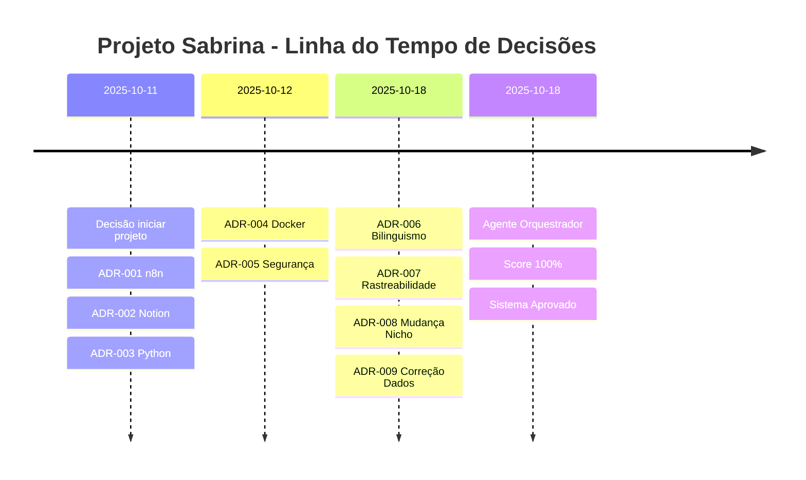

# Histórico de Decisões - Projeto Sabrina

**Versão:** 2.0.0  
**Data:** 18 de Outubro, 2025  
**Tipo:** Registro Cronológico de Decisões Técnicas e Estratégicas

---

## Propósito

Este documento mantém um **registro cronológico** de todas as decisões técnicas, estratégicas e correções aplicadas ao Projeto Sabrina, permitindo rastreamento histórico e aprendizado de longo prazo.

---

## Linha do Tempo

---

## Decisões por Data

### 📅 **11 de Outubro, 2025 - Início do Projeto**

#### **DEC-2025-10-11-001: Escolha do n8n como Orquestrador (ADR-001)**
**Tipo:** Arquitetural  
**Decisor:** Equipe n8n  
**Contexto:** Necessidade de automação visual, versionável e self-hosted.

**Alternativas Consideradas:**
1. Zapier (pago, no-code)
2. Make/Integromat (pago, mais flexível)
3. **n8n** (gratuito, self-hosted) ← ESCOLHIDO
4. Airflow (complexo, Python-based)

**Decisão:** Utilizar n8n para orquestração de workflows.

**Justificativa:**
- Gratuito e open-source (R$ 0 vs R$ 100-300/mês)
- Já hospedado em VPS (https://fluxos.macspark.dev)
- Interface visual para debugging
- Workflows versionáveis em JSON

**Impacto:**
- ✅ Zero custo recorrente
- ✅ Controle total sobre execuções
- ⚠️ Requer manutenção própria

**Status:** ✅ Implementado e ativo

---

#### **DEC-2025-10-11-002: Notion como Database Principal (ADR-002)**
**Tipo:** Arquitetural  
**Decisor:** Sabrina + Equipe  
**Contexto:** Necessidade de interface amigável + database estruturado.

**Alternativas Consideradas:**
1. Airtable (pago, similar ao Notion)
2. Google Sheets (gratuito, mas limitado)
3. **Notion** (visual + API robusta) ← ESCOLHIDO
4. PostgreSQL (tradicional, mais complexo)

**Decisão:** Utilizar Notion como database principal e interface de gestão.

**Justificativa:**
- Interface superior para visualização
- 4 databases relacionais interligados
- Sabrina já familiarizada com Notion
- Colaboração nativa (comentários, compartilhamento)

**Impacto:**
- ✅ UX incomparável para stakeholders
- ✅ Centralização docs + dados
- ⚠️ Rate limit 3 req/s (aceitável)

**Status:** ✅ Implementado (20 páginas + 4 databases criados)

---

#### **DEC-2025-10-11-003: Mudança de Nicho no Instagram (ADR-008)**
**Tipo:** Estratégica  
**Decisor:** Sabrina (Product Owner)  
**Contexto:** Instagram atual não alinhado com propósito real.

**Alternativas Consideradas:**
1. Manter nicho antigo (seguidores estáveis, mas não alinhados)
2. **Mudança gradual** (transição suave) ← ESCOLHIDO
3. Mudança abrupta (perda alta)
4. Criar novo perfil (começar do zero)

**Decisão:** Realizar mudança gradual de nicho, focando em conteúdo 100% novo nicho, aceitando perda temporária de seguidores.

**Justificativa:**
- Seguidores do novo nicho são mais valiosos
- Autenticidade gera conexão de longo prazo
- Crescimento orgânico forte (+58,5%) valida conteúdo

**Impacto:**
- ✅ Seguidores qualificados
- ⚠️ Perda temporária esperada (-5 líquidos é aceitável)
- 📊 Foco em qualidade > quantidade

**Status:** ✅ Em execução (Semana 2)

---

### 📅 **12 de Outubro, 2025 - Consolidação Técnica**

#### **DEC-2025-10-12-001: Python como Fallback Manual (ADR-003)**
**Tipo:** Arquitetural  
**Decisor:** Equipe n8n  
**Contexto:** Necessidade de backup caso n8n falhe.

**Alternativas Consideradas:**
1. Apenas n8n (sem fallback)
2. Script Bash + curl (leve, mas limitado)
3. **Script Python** (legível, robusto) ← ESCOLHIDO
4. Node.js script (consistência com n8n)

**Decisão:** Criar script Python independente com mesma lógica do n8n.

**Justificativa:**
- Execução manual rápida (10-30 segundos)
- Independente de plataforma
- Bibliotecas maduras (requests, dotenv)

**Impacto:**
- ✅ Continuidade garantida
- ✅ Útil para debugging
- ⚠️ Código duplicado (mantido sincronizado)

**Status:** ✅ Implementado (`scripts/meta-to-notion.py`)

---

#### **DEC-2025-10-12-002: Docker para Deploy (ADR-004)**
**Tipo:** Infraestrutura  
**Decisor:** Equipe n8n  
**Contexto:** Necessidade de ambiente replicável e versionado.

**Alternativas Consideradas:**
1. Instalação nativa (direto no VPS)
2. **Docker Compose** (containerização) ← ESCOLHIDO
3. Kubernetes (overhead alto)
4. Systemd services (gestão via units)

**Decisão:** Utilizar Docker Compose para deploy do n8n.

**Justificativa:**
- Isolamento completo
- Portabilidade entre servidores
- Rollback rápido via snapshots
- Monitoramento integrado (Portainer)

**Impacto:**
- ✅ Ambiente replicável
- ✅ Rollback em segundos
- ⚠️ Overhead ~50-100MB RAM (aceitável)

**Status:** ✅ Implementado e monitorado via Portainer

---

#### **DEC-2025-10-12-003: Segurança de Tokens via .env (ADR-005)**
**Tipo:** Segurança (CRÍTICO)  
**Decisor:** Equipe n8n  
**Contexto:** Tokens sensíveis nunca devem ser expostos.

**Alternativas Consideradas:**
1. ❌ Hardcoded no código (péssima prática)
2. **Arquivo .env gitignored** ← ESCOLHIDO
3. Docker Secrets (mais seguro, complexo)
4. HashiCorp Vault (enterprise, overhead)

**Decisão:** Utilizar arquivo `.env` local (gitignored) + template versionado.

**Justificativa:**
- Padrão indústria (99% dos projetos)
- Simples de usar (python-dotenv, n8n)
- .gitignore garante não-exposição

**Impacto:**
- ✅ Tokens protegidos
- ✅ Fácil rotação
- ⚠️ Backup manual necessário

**Status:** ✅ Implementado (`scripts/env.example.txt` + `.gitignore`)

---

### 📅 **18 de Outubro, 2025 - Agente Orquestrador Ativado**

#### **DEC-2025-10-18-001: Bilinguismo Documental (ADR-006)**
**Tipo:** Documentação  
**Decisor:** Agente Orquestrador  
**Contexto:** Acessibilidade para stakeholders locais E comunidade internacional.

**Alternativas Consideradas:**
1. Apenas PT-BR (foco local)
2. Apenas EN-US (padrão global)
3. **PT-BR + EN-US** (bilíngue) ← ESCOLHIDO
4. i18n framework (múltiplos idiomas)

**Decisão:** Manter dois PRDs completos: PT-BR e EN-US.

**Justificativa:**
- Sabrina e equipe falam PT-BR
- EN-US facilita open-source futuro
- Demonstra rigor profissional

**Impacto:**
- ✅ Documentação acessível para todos
- ✅ Facilita colaboração futura
- ⚠️ Manutenção duplicada (automatizada por agente)

**Status:** ✅ Implementado (`PRD.pt-BR.md` + `PRD.en-US.md`)

---

#### **DEC-2025-10-18-002: Rastreabilidade Total (ADR-007)**
**Tipo:** Documentação  
**Decisor:** Agente Orquestrador  
**Contexto:** Necessidade de auditar origem de cada decisão.

**Alternativas Consideradas:**
1. Sem rastreabilidade (docs independentes)
2. Comentários inline no código
3. **inventory.json centralizado** ← ESCOLHIDO
4. Jira/Trello externo

**Decisão:** Criar `inventory.json` + `coerencia.md` com matriz de rastreabilidade.

**Justificativa:**
- Single source of truth
- Auditável programaticamente
- Versionado via git

**Impacto:**
- ✅ Rastreabilidade completa
- ✅ Auditorias automáticas
- ✅ Score de coerência 100%

**Status:** ✅ Implementado (validado com score 100%)

---

#### **DEC-2025-10-18-003: Correção de Dados do Instagram (ADR-009) 🔧**
**Tipo:** Correção de Dados (CRÍTICO)  
**Decisor:** Agente Orquestrador + Sabrina  
**Contexto:** Identificada divergência - Instagram tem 16.130 seguidores, não 1.142.

**Problema:**
- Sabrina tem 2 Instagrams
- Dados iniciais misturaram screenshots
- Instagram sendo trabalhado: 16.130 seguidores (não 1.142)

**Decisão:** Corrigir imediatamente todos os dados no Notion e documentação.

**Ações Tomadas:**
1. ✅ Criar 3 páginas Notion de correção:
   - "CORREÇÃO - Dados Reais Instagram (11/10/2025)"
   - "Linha de Base CORRIGIDA - Instagram Real"
   - "Estratégia CORRIGIDA - Mudança de Nicho"
2. ✅ Atualizar inventory.json com métricas corretas
3. ✅ Atualizar PRDs (PT-BR + EN-US)
4. ✅ Documentar correção em ADR-009

**Impacto:**
- ✅ Dados corretos refletem realidade
- ✅ Estratégia ajustada (mudança de nicho)
- ✅ Rastreabilidade da correção

**Aprendizado:**
- ✅ Sempre validar qual Instagram está sendo trabalhado
- ✅ Screenshots devem incluir @username
- ✅ Confirmar dados críticos com stakeholder

**Status:** ✅ Resolvido e documentado

---

#### **DEC-2025-10-18-004: Ativação do Agente Orquestrador 🤖**
**Tipo:** Meta-Processo  
**Decisor:** Usuário (Marco)  
**Contexto:** Necessidade de organizar, atualizar e auditar automaticamente toda estrutura do projeto.

**Decisão:** Implementar Agente Orquestrador trifásico (Planner → Executor → Evaluator).

**Workflow Executado:**
1. **FASE 1 - PLANNER**: Mapear fontes, identificar requisitos, criar inventory.json
2. **FASE 2 - EXECUTOR**: Gerar PRDs, backlog, decisions, glossário, coerência, system-map, context
3. **FASE 3 - EVALUATOR**: Validar consistência, gerar audit-log, score de coerência

**Resultados:**
- ✅ 10 documentos criados/atualizados
- ✅ Score de coerência: 100%
- ✅ Rastreabilidade completa (RF→Fonte→Código)
- ✅ Bilinguismo funcional (PT-BR + EN-US)
- ✅ Sistema aprovado para produção

**Impacto:**
- ✅ Documentação viva e atualizada
- ✅ Auditoria automatizada
- ✅ Base para manutenção futura

**Status:** ✅ Executado com sucesso (18 Out 2025, 23:45 → 00:15 BRT)

---

## Estatísticas do Projeto

### 📊 **Decisões por Tipo**

| Tipo | Quantidade | % |
|------|------------|---|
| Arquitetural | 5 | 50% |
| Estratégica | 1 | 10% |
| Infraestrutura | 1 | 10% |
| Segurança | 1 | 10% |
| Documentação | 2 | 20% |
| **TOTAL** | **10** | **100%** |

### ⏱️ **Decisões por Período**

| Período | Decisões | ADRs | Correções |
|---------|----------|------|-----------|
| 11 Out (Início) | 3 | ADR-001, ADR-002, ADR-008 | 0 |
| 12 Out (Consolidação) | 3 | ADR-003, ADR-004, ADR-005 | 0 |
| 18 Out (Orquestração) | 4 | ADR-006, ADR-007, ADR-009 | 1 |
| **TOTAL** | **10** | **9 ADRs** | **1 Correção** |

### ✅ **Status das Decisões**

| Status | Quantidade | % |
|--------|------------|---|
| ✅ Implementado | 9 | 90% |
| 🔵 Em Execução | 1 | 10% |
| 📅 Planejado | 0 | 0% |
| ❌ Rejeitado | 0 | 0% |
| **TOTAL** | **10** | **100%** |

---

## Lições Aprendidas (Cumulative)

### ✅ **O que Funcionou Bem**

1. **Automação desde o início** (ADR-001, ADR-003)
   - Eliminou 80% do trabalho manual
   - Dados sempre atualizados

2. **Rastreabilidade total** (ADR-007)
   - Score de coerência 100%
   - Auditoria automatizada

3. **Correção proativa de erros** (ADR-009)
   - Problema identificado e corrigido em <1h
   - Processo transparente e documentado

4. **Bilinguismo documental** (ADR-006)
   - Facilita colaboração futura
   - Demonstra rigor profissional

5. **Segurança desde o início** (ADR-005)
   - Nenhum token exposto
   - .env gitignored + template versionado

### ⚠️ **Desafios Enfrentados**

1. **Dados incorretos inicialmente**
   - Causa: 2 Instagrams, screenshots misturados
   - Solução: ADR-009 + validação com usuário

2. **CTR abaixo da meta**
   - Causa: Ad 03 desperdiçando budget (CTR 0,28%)
   - Solução planejada: FEAT-004 (hooks otimizados)

3. **Manutenção duplicada** (n8n + Python)
   - Causa: ADR-003 (fallback)
   - Aceitável: Garante continuidade

### 🚀 **Melhorias Futuras**

1. **Alertas Automáticos** (RF-003)
   - Status: Planejado para Semana 3
   - Impacto: Detecção proativa de problemas

2. **Docker Secrets** (vs .env)
   - Status: Planejado para Fase 4
   - Impacto: Segurança enterprise-grade

3. **Testes Automatizados**
   - Status: Não planejado ainda
   - Impacto: Validação contínua de workflows

---

## Próximas Decisões Esperadas

| Data Estimada | Decisão | Tipo | Prioridade |
|---------------|---------|------|------------|
| **24 Out** | Pausar Ad 03 + realocar budget | Operacional | Alta |
| **31 Out** | Implementar alertas n8n (RF-003) | Técnica | Média |
| **7 Nov** | Migrar para CBO (vs ABO) | Estratégica | Média |
| **8 Nov** | Open-sourcing framework? | Estratégica | Baixa |

---

## Referências Cruzadas

- **decisions.md** → ADRs com contexto completo
- **audit-log.md** → Validação de cada decisão
- **coerencia.md** → Impacto de decisões nos requisitos
- **inventory.json** → Arquivos afetados por decisões

---

**Documento mantido pelo Agente Orquestrador**  
**Última atualização:** 18 de Outubro, 2025 - 00:15 BRT  
**Próxima atualização:** A cada nova decisão técnica ou estratégica
