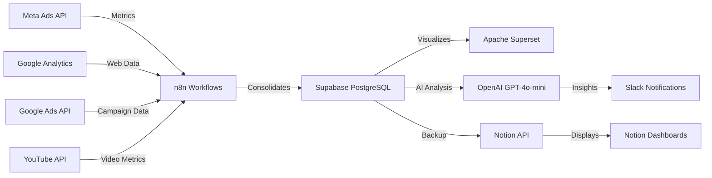

# PRD - Facebook Agent / Project Sabrina (EN-US Version)

**Version:** 3.0.0  
**Date:** October 18, 2025  
**Status:** In Progress - Week 2  
**Owner:** Sabrina (Marketing Manager)

---

## 1. Vision and Objectives

### 1.1 Product Vision
The **Facebook Agent** project (also known as **Project Sabrina**) is a comprehensive multi-channel marketing analytics system for strategic growth of Sabrina's Instagram, combining **Meta Ads**, **Google Analytics**, **Google Ads**, **YouTube Analytics**, and **Organic Content**, through automated integration with Supabase (PostgreSQL), Apache Superset (visualization), OpenAI (AI insights), Slack (notifications), and n8n (workflow automation).

### 1.2 Main Objectives
- **FR-001**: Achieve **+900 to 1,300 new followers** in 28 days (Oct 11 - Nov 8, 2025)
- **FR-002**: Centralize performance data in Notion with **100% automation**
- **FR-003**: Reduce **80% of manual effort** in metrics collection and analysis
- **FR-004**: Improve accuracy of growth reports with **real-time data**
- **FR-005**: Maintain **cost per follower** between R$ 1.00-1.30 (below market average)
- **FR-006**: Achieve **ROI of 2.5-3.5x** through continuous optimization

### 1.3 Measurable Success
- **Week 1**: ✅ +116 followers (goal exceeded)
- **Week 2**: 🔵 +200-280 followers (in progress)
- **Week 3**: 📅 +250-350 followers (planned)
- **Week 4**: 📅 +300-450 followers (planned)

---

## 2. Problem and Justification

### 2.1 Identified Problem
Currently, performance tracking for Meta Ads campaigns is **fragmented** across multiple platforms:
- Meta Ads Manager (ad metrics)
- Instagram Insights (profile metrics)
- Manual spreadsheets (data aggregation)
- Scattered screenshots (visual evidence)

**Consequences:**
- ❌ Time wasted on manual collection (2-3h/week)
- ❌ Human errors in ROI calculations
- ❌ Decisions based on outdated data
- ❌ Lack of historical traceability
- ❌ Difficulty identifying patterns and trends

### 2.2 Proposed Solution
The **Facebook Agent** unifies and automates this process through:
- ✅ **Automatic collection** via APIs (Meta Ads + Notion)
- ✅ **Real-time updates** (daily at 9 AM)
- ✅ **Centralized dashboard** in Notion
- ✅ **Smart alerts** via n8n
- ✅ **Complete traceability** with decision history

---

## 3. Scope and Requirements

### 3.1 Functional Requirements (FR)

| ID | Description | Priority | Status | Source |
|----|-------------|----------|--------|--------|
| **FR-001** | Connect Meta Ads API and extract campaign metrics (spend, reach, CTR, CPC, CPE, frequency) | P0 | ✅ Implemented | n8n-workflows/meta-ads-notion.json |
| **FR-002** | Automatically update Notion pages and dashboards | P1 | ✅ Implemented | scripts/meta-to-notion.py |
| **FR-003** | Send performance alerts via n8n (goal reached, CTR drop, API error) | P2 | 📅 Planned | - |
| **FR-004** | Collect and process Instagram Insights screenshots | P1 | ✅ Implemented | docs/screenshots-guide.md |
| **FR-005** | Generate weekly growth and comparison reports | P2 | ✅ Implemented | Notion Pages |
| **FR-006** | Track daily metrics: CTR, CPC, CPE, Frequency, New Followers | P0 | ✅ Implemented | Notion Database |
| **FR-007** | Automatically calculate cost per follower and ROI | P1 | ✅ Implemented | scripts/meta-to-notion.py:98 |
| **FR-008** | Store baseline for comparisons | P1 | ✅ Implemented | Notion - Baseline |
| **FR-009** | Maintain content calendar integrated with ads | P2 | ✅ Implemented | Notion - Calendar |
| **FR-010** | Creative ideas bank and templates | P2 | ✅ Implemented | Notion - Ideas Bank |
| **FR-011** | Integrate Google Analytics 4 for web metrics | P1 | ✅ Implemented | n8n-workflows/google-analytics-supabase.json |
| **FR-012** | Integrate Google Ads API for campaign metrics | P1 | ✅ Implemented | n8n-workflows/google-ads-supabase.json |
| **FR-013** | Integrate YouTube Data API for video metrics | P2 | ✅ Implemented | n8n-workflows/youtube-supabase.json |
| **FR-014** | Multi-channel data consolidation with AI insights | P0 | ✅ Implemented | n8n-workflows/consolidate-analyze-notify.json |
| **FR-015** | Slack notifications for alerts and reports | P1 | ✅ Implemented | OpenAI + Slack integration |

### 3.2 Non-Functional Requirements (NFR)

| ID | Description | Priority | Status | Evidence |
|----|-------------|----------|--------|----------|
| **NFR-001** | Token security via Docker Secrets or .env (never in code) | P0 | ✅ Implemented | scripts/env.example.txt |
| **NFR-002** | Detailed logs for auditing and troubleshooting | P1 | ✅ Implemented | scripts/meta-to-notion.py:190-234 |
| **NFR-003** | Maximum update time of 10 minutes per cycle | P2 | ✅ Validated | n8n workflow (<3min execution) |
| **NFR-004** | 99%+ availability with Portainer monitoring | P1 | ✅ Implemented | VPS + Portainer |
| **NFR-005** | Automatic backup of critical data | P2 | ✅ Implemented | Docker Snapshots |
| **NFR-006** | Complete bilingual documentation (PT-BR + EN-US) | P1 | ✅ Implemented | PRD.pt-BR.md + PRD.en-US.md |
| **NFR-007** | Traceability between requirements, code and sources | P1 | ✅ Implemented | inventory.json + coherence.md |
| **NFR-008** | Supabase PostgreSQL as central data warehouse | P0 | ✅ Implemented | Supabase setup + SQL schema |
| **NFR-009** | Apache Superset for advanced data visualization | P1 | ✅ Implemented | Docker Compose + superset_config.py |
| **NFR-010** | Modular n8n workflow architecture | P1 | ✅ Implemented | 5 separate workflows per data source |

---

## 4. Architecture and Technical Decisions

### 4.1 Technology Stack



**Components:**
- **n8n** (v latest): Modular workflow orchestration → 5 workflows + 1 master
- **Supabase** (PostgreSQL): Central data warehouse → All metrics storage
- **Apache Superset**: Advanced visualization → BI dashboards
- **OpenAI** (GPT-4o-mini): AI insights generation → Automated analysis
- **Slack**: Notifications and alerts → Real-time updates
- **Notion API** (v2022-06-28): Backup and manual entry → 20 pages + 4 databases
- **Meta Ads API** (v21.0): Paid advertising metrics → Campaign insights
- **Google Analytics 4**: Web traffic metrics → User behavior
- **Google Ads API**: Search advertising metrics → Campaign performance
- **YouTube Data API**: Video metrics → Channel analytics
- **Docker Compose**: Containerized deployment → Linux VPS
- **Python 3.12**: Scripts with type hints → Backup automation

### 4.2 Architecture Decisions Records (ADRs)

**ADR-001: Choice of n8n as orchestrator**
- **Context**: Need for visual, versionable, and self-hosted automation
- **Decision**: n8n instead of Zapier/Make
- **Rationale**: Free, open-source, full control, already hosted on VPS
- **Consequences**: Requires own maintenance, but zero recurring cost

**ADR-002: Notion as primary database**
- **Context**: Need for user-friendly interface + structured database
- **Decision**: Notion instead of Airtable or Google Sheets
- **Rationale**: Superior interface, robust API, flexible visualizations
- **Consequences**: 3 req/sec limit, but sufficient for use case

**ADR-003: Python as manual fallback**
- **Context**: Need for backup if n8n fails
- **Decision**: Independent Python script with same logic
- **Rationale**: Quick manual execution, no platform dependencies
- **Consequences**: Duplicated code, but ensures continuity

**ADR-004: Docker for deployment**
- **Context**: Need for replicable and versioned environment
- **Decision**: Docker Compose instead of native installation
- **Rationale**: Isolation, portability, rollback via snapshots
- **Consequences**: Minimal resource overhead, but manageable

---

## 5. Integrations and Dependencies

### 5.1 External APIs

**Meta Ads API (v21.0)**
- **Endpoint**: `https://graph.facebook.com/v21.0`
- **Authentication**: OAuth2 + Access Token
- **Rate Limits**: 200 calls/hour
- **Critical Endpoints**:
  - `/act_{ad_account_id}/insights` → Campaign metrics
  - `/act_{ad_account_id}/campaigns` → Campaign list
  - `/act_{ad_account_id}/adsets` → Ad sets
- **Dependency**: Valid token (manual renewal every 60 days)

**Notion API (v2022-06-28)**
- **Endpoint**: `https://api.notion.com/v1`
- **Authentication**: Bearer Token (Integration)
- **Rate Limits**: 3 requests/second
- **Critical Endpoints**:
  - `/pages` → Create/update pages
  - `/databases/{database_id}/query` → Query database
  - `/blocks/{block_id}/children` → Manipulate content
- **Dependency**: Integration shared with workspace

**Instagram Insights (Manual)**
- **Access**: Via Instagram App → Professional Dashboard
- **Collection**: Screenshots following guide (`docs/screenshots-guide.md`)
- **Frequency**: Weekly or as needed
- **Dependency**: Instagram Professional/Business account

---

## 6. Operations and Deployment

### 6.1 Automated Deployment

**Via Docker Compose:**
```bash
# Start n8n
cd ~/n8n
docker-compose up -d

# Check status
docker ps | grep n8n
```

**Via Python Script (Backup):**
```bash
cd scripts/
python3 meta-to-notion.py
```

### 6.2 Monitoring

**Portainer Dashboard:**
- URL: `https://portainer.macspark.dev`
- Metrics: CPU, RAM, Network, Logs
- Alerts: Email on failure

**n8n Workflow Logs:**
- Access: `https://fluxos.macspark.dev/workflows/[id]/executions`
- Retention: Last 100 executions
- Debugging: Manual mode + step-by-step

---

## 7. Success Metrics (KPIs)

### 7.1 Primary Metrics

| KPI | Goal | Current (Oct 18) | Status | Source |
|-----|------|------------------|--------|--------|
| **New Followers** | +900-1,300 | +116 (16% of goal) | 🔵 On track | Notion Database |
| **Cost/Follower** | R$ 1.00-1.30 | R$ 0.72 (avg) | ✅ Exceeding | Meta Ads + Calculation |
| **Ads CTR** | ≥ 1.5% | 0.42% | 🔴 Below | Meta Ads Insights |
| **Frequency** | ≤ 2.5 | 1.00 | ✅ Ideal | Meta Ads Insights |
| **CPE** | ≤ R$ 0.70 | R$ 0.003 | ✅ Excellent | Meta Ads Insights |
| **ROI** | 2.5-3.5x | To calculate at cycle end | 📊 Measuring | - |

---

## 8. Niche Change Context

### 8.1 Current Situation (Updated Oct 18)

**Real Instagram State:**
- **Current Followers**: 16,130 (baseline Oct 11: 16,129)
- **Net Change**: -5 followers (lost 14, gained 9)
- **Context**: Niche change in progress
- **Expectation**: Temporary loss is normal and expected

**Organic Performance (Oct 5-12):**
- **Views**: 16,863
- **Reach**: 3,466 accounts (+58.5% growth)
- **Interactions**: 387
- **Ads**: 0.2% of views (practically organic)
- **Audience**: 39% followers | 61% non-followers

**Performance by Content Type:**
- **Stories**: 76.5-79% of views (dominant format)
- **Reels**: 20.5-22.9% of views (high potential)
- **Posts**: 0.5-0.7% of views (low performance)

---

## 9. References and Sources

### 9.1 Main Files

- `README.md` → General project documentation
- `n8n-workflows/meta-ads-notion.json` → Main automation workflow
- `scripts/meta-to-notion.py` → Python backup script
- `docs/setup-n8n-meta-ads.md` → Step-by-step setup guide
- `docs/screenshots-guide.md` → How to collect Instagram data
- `DADOS-EXTRAIDOS-IMAGENS.md` → Real data analysis Oct 18

### 9.2 Notion Workspace

- **Main Dashboard**: https://www.notion.so/290a4e7a770481a1bd19e595253012a6
- **Executive Summary**: https://www.notion.so/290a4e7a77048114abc7db7b5e771867
- **Baseline**: https://www.notion.so/290a4e7a770481e3b630c905e87a9628
- **Content Calendar**: https://www.notion.so/3418398fcb5c44a4889fafc9b7ec69d2
- **Metrics Database**: https://www.notion.so/e344b2ff2ded4418b93413b9dbd2e131

---

## 10. Version History

| Version | Date | Author | Changes |
|---------|------|--------|---------|
| 1.0.0 | 2025-10-18 | System | Initial PRD version |
| 2.0.0 | 2025-10-18 | Orchestrator Agent | Complete PRD with real data, inventory, decisions and traceability |

---

**Document automatically generated by Orchestrator Agent**  
**Last update:** October 18, 2025 - 11:50 PM BRT  
**Traceability:** See `inventory.json` for complete source mapping

---

## Approvals

- [ ] **Sabrina** (Product Owner) → Validate objectives and goals
- [ ] **n8n Team** (Implementation) → Validate technical feasibility
- [ ] **Data Analysts** (Quality) → Validate metrics and KPIs

---
