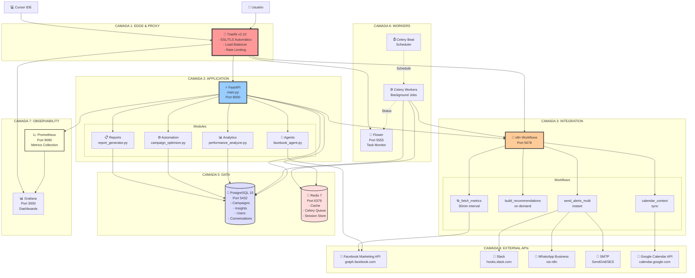
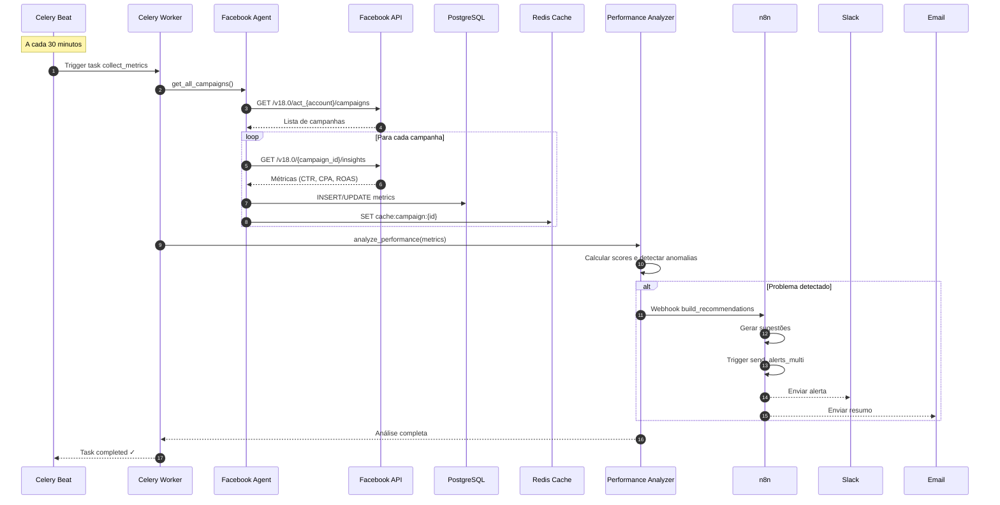
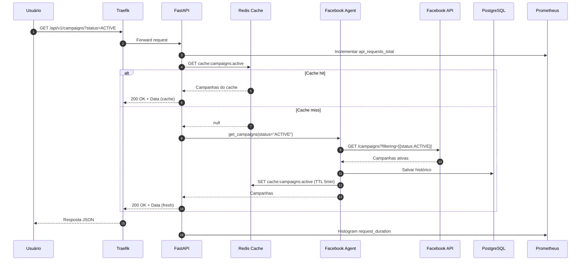
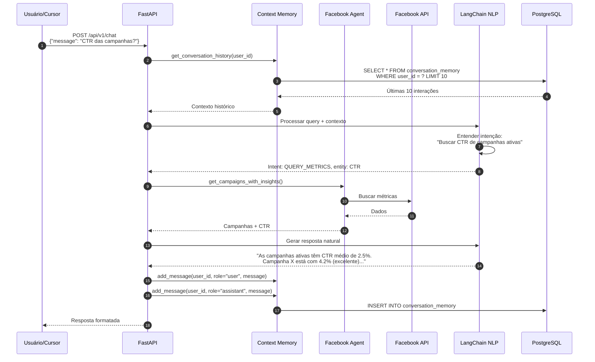
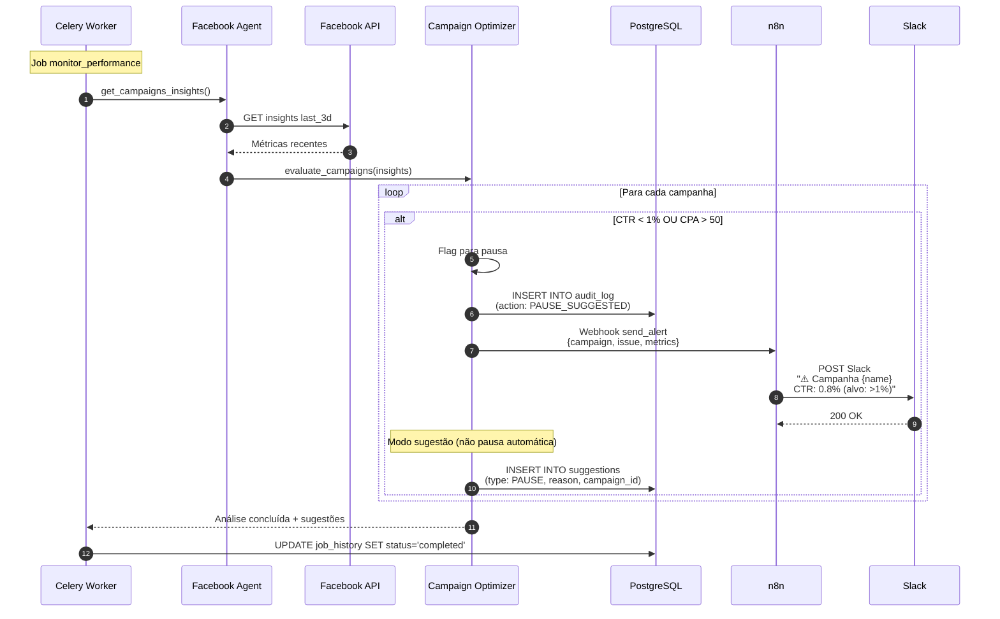
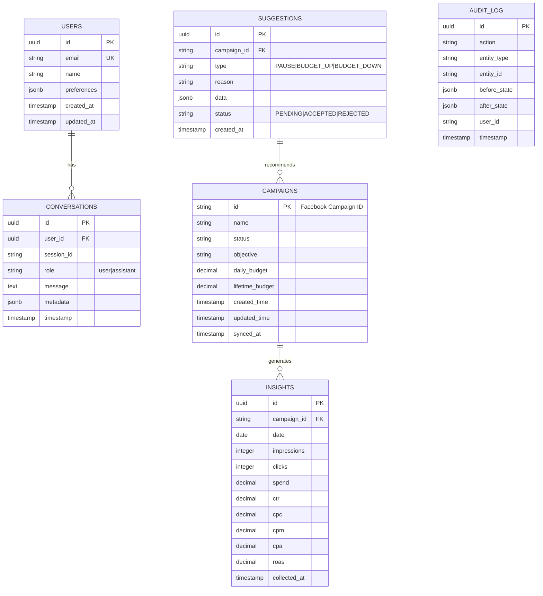
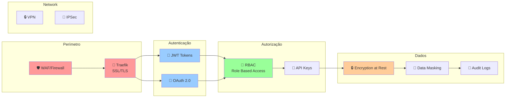
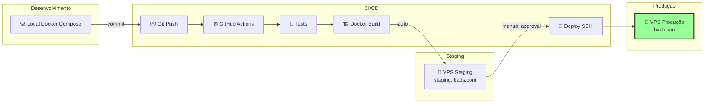

# 🏗️ BLUEPRINT DE ARQUITETURA
## Facebook Ads AI Agent - Diagrama Técnico Completo

---

## 📐 VISÃO GERAL DA ARQUITETURA

### Camadas e Componentes



---

## 🔄 FLUXOS DE DADOS PRINCIPAIS

### Fluxo 1: Coleta Automática de Métricas (Job Agendado)



### Fluxo 2: Usuário Consulta via API REST



### Fluxo 3: Chat Conversacional com Contexto



### Fluxo 4: Automação - Pausa por Performance Ruim



---

## 📦 ESTRUTURA DE MÓDULOS DETALHADA

### Estrutura de Diretórios Completa

```
facebook-ads-ai-agent/
│
├── 📁 src/                          # Código fonte principal
│   │
│   ├── 📁 agents/                   # Agentes inteligentes
│   │   ├── __init__.py
│   │   ├── facebook_agent.py        # Agente principal Facebook Ads
│   │   ├── base_agent.py            # Classe base abstrata
│   │   └── agent_factory.py         # Factory pattern para agentes
│   │
│   ├── 📁 api/                      # APIs REST (FastAPI Routers)
│   │   ├── __init__.py
│   │   ├── campaigns.py             # CRUD de campanhas
│   │   ├── analytics.py             # Endpoints de análise
│   │   ├── automation.py            # Automações e otimizações
│   │   ├── chat.py                  # Interface conversacional
│   │   ├── reports.py               # Geração de relatórios
│   │   └── webhooks.py              # Webhooks n8n
│   │
│   ├── 📁 analytics/                # Módulos de análise
│   │   ├── __init__.py
│   │   ├── performance_analyzer.py  # Análise de performance
│   │   ├── anomaly_detector.py      # Detecção de anomalias (ML)
│   │   ├── trend_analyzer.py        # Análise de tendências
│   │   └── scoring_engine.py        # Engine de pontuação
│   │
│   ├── 📁 automation/               # Automações e otimizações
│   │   ├── __init__.py
│   │   ├── campaign_optimizer.py    # Otimização de campanhas
│   │   ├── budget_allocator.py      # Alocação inteligente de budget
│   │   ├── pause_manager.py         # Gerenciamento de pausas
│   │   └── scaling_advisor.py       # Advisor de escalonamento
│   │
│   ├── 📁 reports/                  # Geração de relatórios
│   │   ├── __init__.py
│   │   ├── report_generator.py      # Gerador principal
│   │   ├── templates/               # Templates de relatórios
│   │   │   ├── daily_report.html
│   │   │   ├── weekly_summary.html
│   │   │   └── executive_report.html
│   │   └── exporters/               # Exportadores
│   │       ├── pdf_exporter.py
│   │       ├── excel_exporter.py
│   │       └── csv_exporter.py
│   │
│   ├── 📁 integrations/             # Integrações externas
│   │   ├── __init__.py
│   │   ├── n8n_client.py            # Cliente n8n
│   │   ├── facebook_client.py       # Cliente Facebook API
│   │   ├── slack_client.py          # Cliente Slack
│   │   ├── whatsapp_client.py       # Cliente WhatsApp
│   │   └── calendar_client.py       # Cliente Google Calendar
│   │
│   ├── 📁 models/                   # Modelos SQLAlchemy
│   │   ├── __init__.py
│   │   ├── campaign.py              # Modelo Campaign
│   │   ├── insight.py               # Modelo Insight
│   │   ├── user.py                  # Modelo User
│   │   ├── conversation.py          # Modelo ConversationMemory
│   │   ├── suggestion.py            # Modelo Suggestion
│   │   └── audit_log.py             # Modelo AuditLog
│   │
│   ├── 📁 schemas/                  # Pydantic Schemas
│   │   ├── __init__.py
│   │   ├── campaign_schemas.py
│   │   ├── insight_schemas.py
│   │   ├── chat_schemas.py
│   │   └── report_schemas.py
│   │
│   ├── 📁 tasks/                    # Tarefas Celery
│   │   ├── __init__.py
│   │   ├── celery_app.py            # Configuração Celery
│   │   ├── collectors.py            # Coletores de métricas
│   │   ├── processors.py            # Processadores de dados
│   │   ├── notifiers.py             # Notificadores (alertas)
│   │   └── schedulers.py            # Agendadores
│   │
│   └── 📁 utils/                    # Utilitários
│       ├── __init__.py
│       ├── config.py                # Configurações (Pydantic Settings)
│       ├── database.py              # Setup SQLAlchemy
│       ├── logger.py                # Logger estruturado
│       ├── api_client.py            # Cliente com rate limiting
│       ├── token_manager.py         # Gerenciador de tokens
│       ├── context_memory.py        # Memória de contexto
│       ├── metrics.py               # Métricas Prometheus
│       ├── cache.py                 # Cache Redis
│       └── validators.py            # Validadores customizados
│
├── 📁 tests/                        # Testes automatizados
│   ├── conftest.py                  # Fixtures compartilhadas
│   ├── 📁 unit/                     # Testes unitários
│   │   ├── test_facebook_agent.py
│   │   ├── test_performance_analyzer.py
│   │   ├── test_campaign_optimizer.py
│   │   └── test_report_generator.py
│   ├── 📁 integration/              # Testes de integração
│   │   ├── test_api_endpoints.py
│   │   ├── test_facebook_api.py
│   │   ├── test_n8n_webhooks.py
│   │   └── test_database.py
│   ├── 📁 e2e/                      # Testes end-to-end
│   │   ├── test_full_flow.py
│   │   └── test_automation_flow.py
│   └── 📁 features/                 # BDD/Gherkin
│       ├── account_disabled.feature
│       ├── performance_alert.feature
│       └── budget_optimization.feature
│
├── 📁 alembic/                      # Migrações de banco
│   ├── env.py
│   ├── script.py.mako
│   └── versions/
│       ├── 001_initial_schema.py
│       ├── 002_add_suggestions.py
│       └── 003_add_audit_log.py
│
├── 📁 config/                       # Arquivos de configuração
│   ├── prometheus.yml               # Config Prometheus
│   ├── grafana/
│   │   ├── datasources.yml
│   │   └── dashboards/
│   │       ├── system_health.json
│   │       ├── facebook_ads.json
│   │       └── agent_activity.json
│   └── n8n/
│       ├── workflows/
│       │   ├── fb_fetch_metrics.json
│       │   ├── send_alerts_multi.json
│       │   └── calendar_context.json
│       └── credentials.json.example
│
├── 📁 scripts/                      # Scripts utilitários
│   ├── deploy.sh                    # Script de deploy
│   ├── backup.sh                    # Script de backup
│   ├── seed_database.py             # Popular banco com dados teste
│   └── migrate_data.py              # Migração de dados
│
├── 📁 docs/                         # Documentação
│   └── prd/facebook-ads-agent/
│       ├── PRD.en-US.md
│       ├── decisions.md
│       ├── backlog.csv
│       ├── coerencia.md
│       └── system-map.md
│
├── 📁 logs/                         # Logs da aplicação
│   ├── app.log
│   ├── celery.log
│   └── error.log
│
├── 📁 data/                         # Dados e cache
│   ├── cache/                       # Cache local
│   └── exports/                     # Relatórios exportados
│
├── main.py                          # Ponto de entrada FastAPI
├── requirements.txt                 # Dependências Python
├── requirements-dev.txt             # Dependências desenvolvimento
├── Dockerfile                       # Container aplicação
├── docker-compose.yml               # Orquestração dev
├── docker-compose.prod.yml          # Orquestração produção
├── .env.example                     # Template variáveis ambiente
├── .gitignore                       # Git ignore
├── pytest.ini                       # Config pytest
├── Makefile                         # Comandos utilitários
├── ci-cd.yml                        # Pipeline GitHub Actions
├── locustfile.py                    # Testes de carga
├── alembic.ini                      # Config Alembic
└── README.md                        # Documentação principal
```

---

## 🗄️ MODELO DE DADOS (Entidades Principais)

### Schema PostgreSQL



---

## 🔐 SEGURANÇA E CONFORMIDADE

### Camadas de Segurança



### Conformidade LGPD

| Requisito | Implementação | Status |
|-----------|---------------|--------|
| Consentimento | Termo de aceite na criação de usuário | ✅ |
| Anonimização | Hash de dados sensíveis, sem PII desnecessário | ✅ |
| Direito ao Esquecimento | Endpoint DELETE /api/v1/users/{id}/data | 🟡 |
| Portabilidade | Endpoint GET /api/v1/users/{id}/export | 🟡 |
| Auditoria | Tabela audit_log com histórico completo | ✅ |
| Segurança | Criptografia em repouso e trânsito | ✅ |
| DPO | Contato data-protection@company.com | 🟡 |

---

## 📊 OBSERVABILIDADE - STACK COMPLETA

### Métricas Prometheus

```yaml
# Métricas customizadas da aplicação

# Counters (eventos que só aumentam)
- api_requests_total{method, endpoint, status}
- facebook_api_calls_total{method, status}
- alerts_sent_total{channel, severity}
- suggestions_generated_total{type}
- campaigns_analyzed_total

# Histograms (distribuição de valores)
- request_duration_seconds{method, endpoint}
- facebook_api_latency_seconds{method}
- database_query_duration_seconds{table}
- celery_task_duration_seconds{task_name}

# Gauges (valores instantâneos)
- active_campaigns_count
- daily_spend_usd
- active_users_count
- redis_memory_usage_bytes
- postgres_connections_active

# Summaries
- campaign_ctr_distribution
- campaign_cpa_distribution
```

### Dashboards Grafana

#### Dashboard 1: System Health
- CPU, RAM, Disk usage
- Network I/O
- Container health
- Error rates

#### Dashboard 2: Facebook Ads Performance
- Spend vs Budget
- CTR trends
- CPA trends
- ROAS trends
- Campaign count by status

#### Dashboard 3: Agent Activity
- Suggestions generated/hour
- Alerts sent/hour
- Automations executed
- Chat interactions

#### Dashboard 4: API Metrics
- Requests/second
- Latency P50/P95/P99
- Error rate 4xx/5xx
- Top endpoints

---

## 🚀 DEPLOY E ESCALABILIDADE

### Estratégia de Deploy



### Escalabilidade Horizontal

| Componente | Limite Atual | Escala até | Como Escalar |
|------------|--------------|------------|--------------|
| FastAPI | 1 instância | 10+ | Adicionar replicas no docker-compose, load balancer Traefik |
| Celery Workers | 1 worker | 20+ | Aumentar replicas, usar Kubernetes |
| PostgreSQL | 1 instância | Read replicas | Master-Slave replication, PgPool |
| Redis | 1 instância | Cluster | Redis Cluster mode (3+ nodes) |
| n8n | 1 instância | Queue mode | n8n Queue mode com múltiplos workers |

---

**Blueprint criado por:** AI Agent (Claude Sonnet 4.5)  
**Data:** 18 de Outubro de 2025  
**Versão:** 1.0.0


