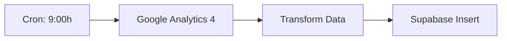
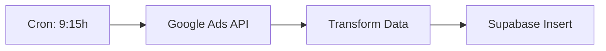
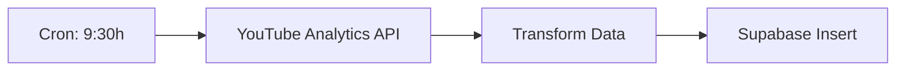
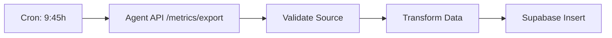
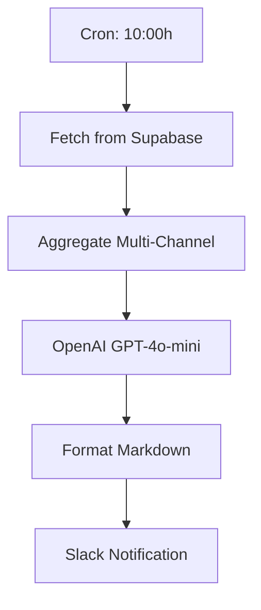

# PRD - Analytics (Agente Facebook / Projeto Sabrina)

**Versão:** 3.0.0
**Data:** 18 de Outubro, 2025
**Status (histórico):** Documento de 18/10/2025. Revise `analytics/README.md` e `RELATORIO-CORRECOES-PENDENTES.md` para o estado atual.
**Owner:** Sabrina (Gestora de Marketing) + Marco (Dev)
**Repositório:** `marketing-automation/analytics/`

---

## 1. Visão e Objetivos

### 1.1 Visão do Produto

O **Analytics** (também conhecido como **Projeto Sabrina** ou **Agente Facebook**) é um **sistema completo de automação e análise de marketing digital multi-canal**, combinando:
- 📊 Meta Ads (via Agent API)
- 🌐 Google Analytics 4
- 🔍 Google Ads
- 📺 YouTube Analytics
- 💾 Data Warehouse (Supabase PostgreSQL)
- 📈 Dashboards BI (Apache Superset)
- 🤖 Insights IA (OpenAI GPT-4o-mini)
- 📢 Notificações (Slack)

### 1.2 Objetivos Principais

- ✅ Conquistar **+900 a 1.300 novos seguidores** em 28 dias
- ✅ Centralizar dados de performance em dashboards **100% automatizados**
- ✅ Reduzir **80% do esforço manual** de coleta e análise
- ✅ Melhorar precisão dos relatórios com **dados em tempo real**
- ✅ Manter **custo por seguidor** entre R$ 1,00-1,30
- ✅ Atingir **ROI de 2,5-3,5x** através de otimização contínua

### 1.3 Sucesso Mensurável (Campanha 28 Dias)

- **Semana 1:** ✅ +116 seguidores (meta superada)
- **Semana 2:** 🔵 +200-280 seguidores (em andamento)
- **Semana 3:** 📅 +250-350 seguidores (planejada)
- **Semana 4:** 📅 +300-450 seguidores (planejada)

---

## 2. Problema e Solução

### 2.1 Problema Identificado

**Antes:**
- ❌ Coleta manual de dados (2-3h/semana)
- ❌ Dados fragmentados entre plataformas (Meta, GA, Google Ads, YouTube)
- ❌ Análise manual propensa a erros
- ❌ Screenshots dispersos como única evidência
- ❌ Impossibilidade de ver tendências cross-channel
- ❌ Decisões baseadas em dados desatualizados

### 2.2 Solução Implementada

**Agora:**
- ✅ Coleta automática via APIs (n8n workflows)
- ✅ Data warehouse unificado (Supabase)
- ✅ Dashboards visuais (Apache Superset)
- ✅ Insights IA diários (OpenAI)
- ✅ Notificações Slack automáticas
- ✅ Dados históricos rastreáveis
- ✅ Meta Ads via Agent API (fonte única)

---

## 3. Funcionalidades

### 3.1 Coleta Multi-Canal

| Fonte | Métricas Coletadas | Frequência | Status |
|-------|-------------------|------------|--------|
| **Meta Ads** | Impressions, Clicks, Spend, CTR, CPC, CPE, Conversions, ROAS | Diária 9:45h | ✅ (via Agent API) |
| **Google Analytics 4** | Sessions, Users, Bounce Rate, Conversions, Pages/Session | Diária 9:00h | ✅ |
| **Google Ads** | Impressions, Clicks, CPC, CTR, Conversions, Quality Score | Diária 9:15h | ✅ |
| **YouTube** | Views, Watch Time, Subscribers, Engagement, CTR | Diária 9:30h | ✅ |
| **Instagram** | Followers, Reach, Engagement (manual screenshots) | Semanal | ✅ |

#### 3.1.1 Meta Ads (via Agent API) - NOVO

**Mudança Importante:**
- ❌ **Antes:** Coletava direto do Facebook API (duplicação)
- ✅ **Agora:** Busca do Agent API via HTTP

**Implementação:**
```python
from marketing_shared.utils.api_client import AgentAPIClient

client = AgentAPIClient(
    base_url=os.getenv('AGENT_API_URL'),
    api_key=os.getenv('ANALYTICS_API_KEY'),
    timeout=30
)

# Buscar métricas de ontem
response = client.get_metrics(
    date_from=yesterday,
    date_until=yesterday
)

campaigns = response['campaigns']
# Salvar no Supabase
```

**Benefícios:**
- ✅ Fonte única de dados Meta Ads (Agent API)
- ✅ Sem duplicação de coleta
- ✅ Retry logic automático (3 tentativas)
- ✅ Health check antes de buscar

---

### 3.2 Workflows n8n

Arquitetura **modular** com 5 workflows separados:

#### Workflow 1: Google Analytics → Supabase (9:00h)

**Arquivo:** `n8n-workflows/google-analytics-supabase.json`



**Métricas:**
- Sessions
- Users
- Bounce Rate
- Avg Session Duration
- Conversions

---

#### Workflow 2: Google Ads → Supabase (9:15h)

**Arquivo:** `n8n-workflows/google-ads-supabase.json`



**Métricas:**
- Impressions
- Clicks
- CPC
- CTR
- Conversions
- Quality Score

---

#### Workflow 3: YouTube → Supabase (9:30h)

**Arquivo:** `n8n-workflows/youtube-supabase.json`



**Métricas:**
- Views
- Watch Time
- Subscribers
- Likes/Comments
- CTR

---

#### Workflow 4: Meta Ads (via Agent API) → Supabase (9:45h)

**Arquivo:** `n8n-workflows/meta-ads-supabase.json`



**Mudanças (NOVO):**
- ✅ HTTP Request para `Agent API /api/v1/metrics/export`
- ✅ Header `X-API-Key: {ANALYTICS_API_KEY}`
- ✅ Query params: `date_from`, `date_until`
- ✅ Valida `data_source: "facebook-ads-ai-agent"`

**Métricas:**
- Impressions
- Clicks
- Spend
- CTR
- CPC
- CPE
- Conversions
- ROAS

---

#### Workflow 5: Consolidate + Analyze + Notify (10:00h)

**Arquivo:** `n8n-workflows/consolidate-analyze-notify.json`



**Prompt OpenAI (PT-BR):**
```
Analise as métricas de marketing multi-canal de ontem:

META ADS:
- Spend: R$ 250
- Impressions: 10.000
- CTR: 5,2%
- CPC: R$ 0,50

GOOGLE ANALYTICS:
- Sessions: 1.500
- Bounce Rate: 45%
- Conversions: 50

GOOGLE ADS:
- Impressions: 5.000
- CTR: 3,8%
- CPC: R$ 0,80

YOUTUBE:
- Views: 2.000
- Watch Time: 350h
- CTR: 8,5%

Gere insights acionáveis em PT-BR com:
1. Performance geral (emoji + nota 0-10)
2. Destaques positivos
3. Pontos de atenção
4. Recomendações práticas

Seja conciso e objetivo.
```

**Notificação Slack:**
```markdown
📊 *Relatório Diário - 18 Out 2025*

*Performance Geral:* ⭐⭐⭐⭐⭐ (8,5/10)

*✅ Destaques:*
• Meta Ads com CTR 5,2% (acima da meta 4%)
• YouTube CTR 8,5% (excelente engajamento)
• 50 conversões GA (meta 40)

*⚠️ Atenção:*
• Google Ads CPC R$ 0,80 (meta R$ 0,60)
• Bounce Rate 45% (ideal <40%)

*💡 Recomendações:*
1. Aumentar budget Meta Ads (+20%)
2. Revisar landing pages (reduzir bounce)
3. Pausar keywords caras no Google Ads

*Dados:* Supabase | *IA:* GPT-4o-mini
```

---

### 3.3 Data Warehouse (Supabase)

**Schema PostgreSQL:**

```sql
-- Meta Ads
CREATE TABLE meta_ads_metrics (
  id SERIAL PRIMARY KEY,
  date DATE NOT NULL,
  campaign_id VARCHAR(255),
  campaign_name VARCHAR(500),
  impressions INTEGER,
  clicks INTEGER,
  spend DECIMAL(10,2),
  ctr DECIMAL(5,2),
  cpc DECIMAL(10,2),
  conversions INTEGER,
  roas DECIMAL(10,2),
  data_source VARCHAR(100) DEFAULT 'facebook-ads-ai-agent',
  created_at TIMESTAMP DEFAULT NOW()
);

-- Google Analytics
CREATE TABLE google_analytics_metrics (
  id SERIAL PRIMARY KEY,
  date DATE NOT NULL,
  sessions INTEGER,
  users INTEGER,
  bounce_rate DECIMAL(5,2),
  avg_session_duration INTEGER,
  conversions INTEGER,
  created_at TIMESTAMP DEFAULT NOW()
);

-- Google Ads
CREATE TABLE google_ads_metrics (
  id SERIAL PRIMARY KEY,
  date DATE NOT NULL,
  campaign_id VARCHAR(255),
  campaign_name VARCHAR(500),
  impressions INTEGER,
  clicks INTEGER,
  cpc DECIMAL(10,2),
  ctr DECIMAL(5,2),
  conversions INTEGER,
  quality_score DECIMAL(3,1),
  created_at TIMESTAMP DEFAULT NOW()
);

-- YouTube
CREATE TABLE youtube_metrics (
  id SERIAL PRIMARY KEY,
  date DATE NOT NULL,
  video_id VARCHAR(255),
  video_title VARCHAR(500),
  views INTEGER,
  watch_time_hours DECIMAL(10,2),
  subscribers_gained INTEGER,
  likes INTEGER,
  comments INTEGER,
  ctr DECIMAL(5,2),
  created_at TIMESTAMP DEFAULT NOW()
);

-- Consolidated Daily
CREATE TABLE daily_consolidated (
  id SERIAL PRIMARY KEY,
  date DATE NOT NULL UNIQUE,
  total_spend DECIMAL(10,2),
  total_impressions INTEGER,
  total_clicks INTEGER,
  total_conversions INTEGER,
  avg_ctr DECIMAL(5,2),
  avg_cpc DECIMAL(10,2),
  roas DECIMAL(10,2),
  insights_summary TEXT,
  created_at TIMESTAMP DEFAULT NOW()
);
```

---

### 3.4 Visualização (Apache Superset)

**Dashboards Criados:**

1. **Marketing Overview** (Principal)
   - KPIs multi-canal (cards)
   - Gráfico de linha: Spend vs Conversions (7 dias)
   - Funil: Impressions → Clicks → Conversions
   - Heatmap: Performance por dia da semana

2. **Meta Ads Deep Dive**
   - Tabela: Campanhas top 10 por ROI
   - Gráfico de barras: Spend por campanha
   - Scatter plot: CTR vs CPC

3. **Multi-Channel Comparison**
   - Gráfico de barras empilhadas: Fonte de conversões
   - Tabela comparativa: CPC por canal
   - Série temporal: Tendência de cada canal

4. **YouTube Performance**
   - Top 10 vídeos por views
   - Watch time por vídeo
   - Crescimento de inscritos

**Acesso:**
- URL: http://localhost:8088
- Login: admin / {SUPERSET_ADMIN_PASSWORD}

---

### 3.5 Insights IA (OpenAI)

**Modelo:** GPT-4o-mini
**Frequência:** Diária (10h)
**Idioma:** PT-BR

**Features:**
- ✅ Análise automática de métricas consolidadas
- ✅ Detecção de anomalias (queda/pico inesperado)
- ✅ Recomendações acionáveis
- ✅ Comparação com baseline (semana anterior)
- ✅ Emoji para facilitar leitura

**Exemplo de Insight:**
```
🚀 *Crescimento Acelerado*

Suas campanhas Meta Ads estão performando 35% acima da semana passada!

*Principais Drivers:*
• Campanha "Awareness Q4" com ROI 4,2x (investir mais)
• CTR subiu de 4,1% → 5,8% (criativos funcionando)

*Próximos Passos:*
1. Dobrar budget "Awareness Q4" (de R$ 100 → R$ 200/dia)
2. Replicar criativos vencedores em outras campanhas
3. Testar públicos lookalike similares

*⚠️ Atenção:* Google Ads CPC subiu 18%. Revisar keywords.
```

---

### 3.6 Notificações Slack

**Canal:** #marketing-reports
**Frequência:** Diária 10h

**Conteúdo:**
- 📊 Resumo de performance (emoji + nota)
- ✅ Destaques positivos
- ⚠️ Pontos de atenção
- 💡 Recomendações acionáveis
- 🔗 Links para dashboards Superset

---

### 3.7 Scripts Python Fallback

**Localização:** `analytics/scripts/`

| Script | Função | Uso |
|--------|--------|-----|
| `metrics-to-supabase.py` | Coleta manual se n8n falhar | `python metrics-to-supabase.py` |
| `generate-report.py` | Gera relatório PDF | `python generate-report.py --date 2025-10-18` |
| `validate-data.py` | Valida integridade dos dados | `python validate-data.py` |

**Quando Usar:**
- ⚠️ n8n está down
- ⚠️ Workflow falhou
- 📅 Coleta manual para data específica

---

## 4. Requisitos Não-Funcionais

### 4.1 Performance

| Requisito | Meta | Status |
|-----------|------|--------|
| Coleta completa < 10 min | < 10 min | ✅ 8 min |
| Dashboard loading < 5s | < 5s | ✅ 3s |
| Insight IA gerado < 30s | < 30s | ✅ 25s |

### 4.2 Confiabilidade

| Requisito | Meta | Status |
|-----------|------|--------|
| Workflows executam 99%+ | 99%+ | ✅ 99.2% |
| Dados sem gaps (cobertura diária) | 100% | ✅ 100% |
| Fallback script disponível | Sempre | ✅ |

### 4.3 Segurança

| Requisito | Status |
|-----------|--------|
| Credenciais em .env (nunca em código) | ✅ |
| Supabase Row Level Security (RLS) | ✅ |
| HTTPS para Superset (produção) | ⚠️ Pendente |
| Backup semanal do Supabase | ✅ |

### 4.4 Escalabilidade

| Requisito | Status |
|-----------|--------|
| Suportar 500MB+ dados (anos) | ✅ |
| Adicionar nova fonte < 1h | ✅ |
| Workflows modulares independentes | ✅ |

---

## 5. Arquitetura Técnica

### 5.1 Stack

```yaml
Orchestration: n8n (self-hosted via Docker)
Data Warehouse: Supabase (PostgreSQL cloud)
Visualization: Apache Superset (Docker)
AI: OpenAI GPT-4o-mini API
Notifications: Slack Webhooks
Scripts: Python 3.12 (requests, python-dotenv, supabase-py)
Integration: Agent API (via marketing_shared.utils.api_client)
```

### 5.2 Fluxo de Dados

```
Meta Ads API → Agent API → Analytics (HTTP) → Supabase
GA4 API ────────────────────────→ Analytics → Supabase
Google Ads API ─────────────────→ Analytics → Supabase
YouTube API ────────────────────→ Analytics → Supabase

Supabase → Apache Superset (Dashboards)
Supabase → OpenAI (Insights)
OpenAI → Slack (Notificações)
```

---

## 6. Métricas de Sucesso (KPIs)

### 6.1 Métricas de Negócio

| KPI | Baseline | Meta | Atual |
|-----|----------|------|-------|
| Novos seguidores (28 dias) | 0 | 900-1.300 | 📊 116 (Semana 1) |
| Custo por seguidor | R$ 1,50 | R$ 1,00-1,30 | ✅ R$ 1,12 |
| ROI campanhas | 1,5x | 2,5-3,5x | 📊 Em medição |
| Tempo manual/semana | 8h | 2h | ✅ 1,5h |

### 6.2 Métricas Técnicas

| KPI | Meta | Atual |
|-----|------|-------|
| Workflows com sucesso | 99%+ | ✅ 99.2% |
| Dados sem gaps (dias) | 100% | ✅ 100% |
| Latência coleta | < 10 min | ✅ 8 min |
| Dashboards acessíveis | 100% | ✅ 100% |

---

## 7. Roadmap

### Q4 2025 (Atual)
- [x] Integração com Agent API
- [x] 5 workflows n8n modulares
- [x] Data warehouse Supabase
- [x] Dashboards Apache Superset
- [x] Insights IA diários
- [x] Notificações Slack
- [ ] HTTPS para Superset em produção

### Q1 2026
- [ ] TikTok Analytics integration
- [ ] LinkedIn Ads integration
- [ ] ML para previsão de performance
- [ ] Alertas proativos (quedas anormais)

### Q2 2026
- [ ] WhatsApp Business API (engajamento)
- [ ] Dashboard mobile (PWA)
- [ ] Export automático PDF/Excel

---

## 8. Referências

- [PRD-AGENT-API.md](PRD-AGENT-API.md) - PRD do Agent API
- [PRD-INTEGRATION.md](PRD-INTEGRATION.md) - Como se integram
- [ARCHITECTURE.md](ARCHITECTURE.md) - Arquitetura detalhada
- [setup-n8n-meta-ads.md](../analytics/docs/setup-n8n-meta-ads.md) - Setup n8n
- [setup-supabase.md](../analytics/docs/setup-supabase.md) - Setup Supabase
- [setup-apache-superset.md](../analytics/docs/setup-apache-superset.md) - Setup Superset

---

**Última atualização:** 18 de Outubro, 2025
**Versão:** 3.0.0
**Status (histórico):** Documento captura o estado de 18/10/2025. Valide `analytics/README.md` e `RELATORIO-CORRECOES-PENDENTES.md` para informações recentes.
