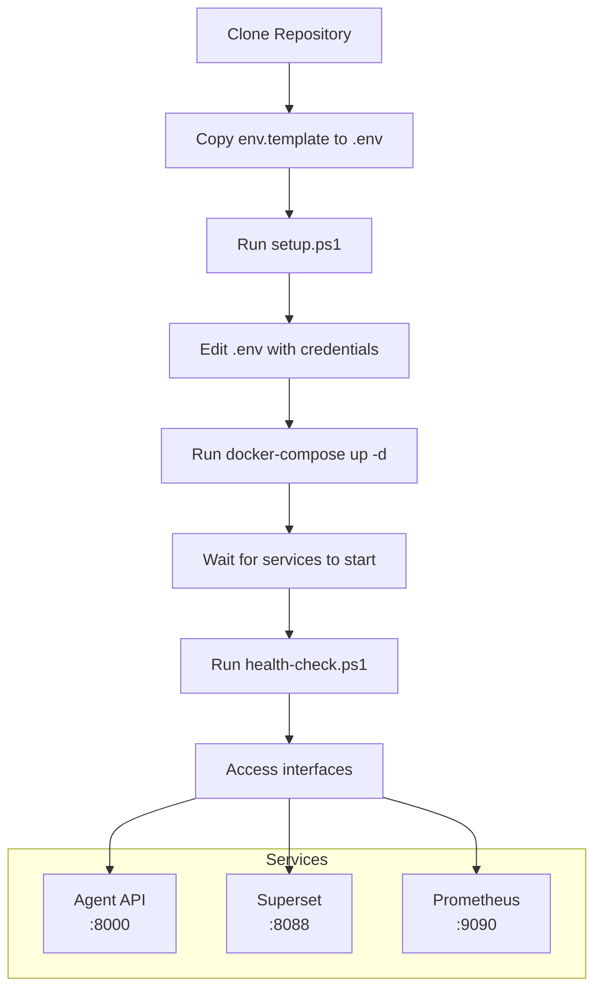

# Quick Start - Marketing Automation Platform

**Tempo estimado:** 15 minutos  
**Última atualização:** 23 de Outubro, 2025  
**Versão:** 2.0.0

---

## 🚀 Início Rápido (15 minutos)

### Fluxo de Setup



### 1. Pré-requisitos

- ✅ Docker Desktop instalado e rodando
- ✅ Python 3.12+ instalado
- ✅ Git configurado
- ✅ Conta Facebook Business Manager

### 2. Configurar Ambiente

```powershell
# 1. Navegar para o projeto
cd C:\Users\marco\Macspark\marketing-automation

# 2. Copiar template de configuração
Copy-Item env.template .env

# 3. Gerar API keys automaticamente
.\scripts\setup.ps1
```

### 3. Editar .env

Abra `.env` e configure as credenciais obrigatórias:

```bash
# Facebook API (OBRIGATÓRIO)
FACEBOOK_ACCESS_TOKEN=seu_token_aqui
FACEBOOK_AD_ACCOUNT_ID=act_123456789

# Supabase (OBRIGATÓRIO)
SUPABASE_URL=https://seu-projeto.supabase.co
SUPABASE_SERVICE_KEY=sua_service_key

# Senhas (geradas automaticamente)
ANALYTICS_API_KEY=chave_gerada_automaticamente
SECRET_KEY=chave_gerada_automaticamente
POSTGRES_PASSWORD=senha_forte_gerada
```

### 4. Instalar Dependências

```powershell
# Instalar shared package
cd shared
pip install -e .
cd ..

# Verificar instalação
python -c "from marketing_shared.utils.api_client import AgentAPIClient; print('✅ Shared package OK')"
```

### 5. Subir Serviços

```powershell
# Subir stack completa
docker-compose -f docker-compose.integrated.yml up -d

# Aguardar inicialização (~2 minutos)
.\scripts\health-check.ps1
```

**Output esperado:**
```
✅ Agent API
✅ Metrics Endpoint  
✅ Superset
✅ PostgreSQL
```

### 6. Testar Sistema

```powershell
# Teste 1: API funcionando
curl http://localhost:8000/health

# Teste 2: Coletar métricas
cd analytics\scripts
python metrics-to-supabase.py
```

---

## 🎯 Acessar Interfaces

### Agent API (Swagger)
- **URL:** http://localhost:8000/docs
- **Funcionalidade:** Explorar endpoints, testar API

### Apache Superset (Dashboards)
- **URL:** http://localhost:8088
- **User:** admin
- **Pass:** (ver SUPERSET_ADMIN_PASSWORD no .env)

### Prometheus (Monitoring)
- **URL:** http://localhost:9090
- **Funcionalidade:** Métricas do sistema

---

## 🆘 Problemas Comuns

### Docker não inicia
```powershell
# Verificar se Docker Desktop está rodando
docker ps

# Se não estiver, abrir Docker Desktop e aguardar
```

### Porta em uso
```powershell
# Ver o que está usando a porta
netstat -ano | findstr :8000

# Parar processo (substitua PID)
taskkill /PID numero_pid /F
```

### Shared package não encontrado
```powershell
cd shared
pip install -e .
cd ..
```

### Facebook API retorna 403
1. Acessar https://business.facebook.com/settings
2. Ir em "Contas" → "Apps" → "Marketing API"
3. Adicionar permissões: `ads_management`, `ads_read`, `business_management`
4. Aguardar ~5 minutos propagação

---

## 📚 Próximos Passos

Após setup inicial:

1. **Configurar permissões Facebook** (se ainda não fez)
2. **Testar coleta de métricas** (`python metrics-to-supabase.py`)
3. **Criar dashboards no Superset**
4. **Configurar workflows N8N** (opcional)
5. **Configurar alertas Slack** (opcional)

---

## 🔗 Documentação Completa

- **Guia detalhado:** [USER-GUIDE.md](../USER-GUIDE.md)
- **Arquitetura:** [ARCHITECTURE.md](../architecture/ARCHITECTURE.md)
- **Troubleshooting:** [TROUBLESHOOTING.md](../reference/troubleshooting/TROUBLESHOOTING.md)
- **Navegação:** [INDEX.md](../INDEX.md)

---

**Tempo total:** ~15 minutos  
**Dificuldade:** Fácil  
**Resultado:** Sistema 100% operacional

---

**Próxima ação:** Configurar permissões Facebook → [USER-GUIDE.md](../USER-GUIDE.md) tem o guia detalhado!
